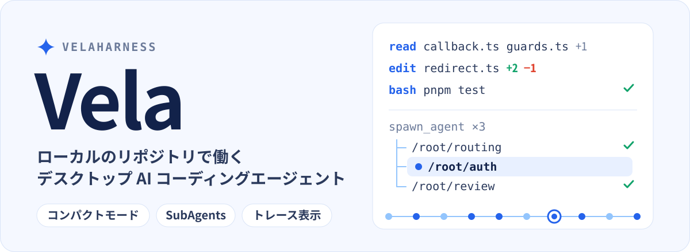

<p align="center">
  
</p>

<p align="center">
  <a href="./README.md">English</a> · <a href="./README.zh-CN.md">简体中文</a> · <a href="./README.zh-TW.md">繁體中文</a> · <b>日本語</b> · <a href="./README.ko.md">한국어</a>
</p>

<p align="center">
  <a href="#コンパクトモード">コンパクトモード</a> · <a href="#subagents">SubAgents</a> · <a href="#トレース表示">トレース表示</a> · <a href="#はじめる">はじめる</a> · <a href="#開発">開発</a>
</p>

Vela は、手元のマシンにあるリポジトリの中で AI エージェントが作業するデスクトップアプリです。プロジェクトを読み取り、タスクを分割し、コードを編集して実行します。進捗はコンパクトなチャットで追い、サブエージェントは専用パネルで確認し、実行トレースで一つひとつのステップを検証できます。

## コンパクトモード

**ツール呼び出しを 1 行の処理ステップにまとめ、タスクの内容を主役にします。** コンパクトモードは初期設定でオンです。ファイルの読み取り、コードの編集、コマンドの実行はそれぞれ 1 行で表示され、連続した呼び出しは展開できる要約に自動でまとまります。ファイル名をクリックすると右側にプレビューが開き、編集を展開すると diff、コマンドを展開すると出力を確認できます。完了後はターン全体を折りたたんで、結果だけを残すこともできます。

次の例では、ファイルの参照と編集の要約を展開して、「問題の特定 → 修正 → 的を絞った検証」という一連の流れを示しています。

<p align="center">
  <a href="./assets/readme/vela-compact.png"></a>
</p>

コンパクト表示とカード表示は、「設定 → 会話の表示 → ツール呼び出しの表示」で切り替えられます。

## SubAgents

**メインのエージェントが全体を取りまとめ、サブエージェントが調査・実装・レビューを並行して進めます。** 操作感は Codex と同じスタイルです。`spawn_agent` でタスクを分割し、`send_message` で発見を共有し、`followup_task` で作業を追加します。サブエージェントは自分のサブタスクも作成でき、パスで整理されたエージェントツリーになります。

メインのチャットにはタスクの概要と結論が残ります。`/root/auth` のようなエージェントのパスをクリックすると、そのメッセージ、思考、ツール呼び出し、最終結果が右側の独立したパネルで確認できます。タブとエージェント一覧でサブタスクを切り替えられ、メインのチャットと各エージェントのパネルはそれぞれ独立してスクロールします。

例では、ログインの不具合を `routing`（調査）、`auth`（修正）、`review`（境界条件のレビュー）に分け、右側で `auth` の実行ストリームを開いています。

<p align="center">
  <a href="./assets/readme/vela-subagents.png"></a>
</p>

`explore` サブエージェントは読み取り専用、`general` サブエージェントは現在のセッションの実行権限を使います。作成されたサブエージェントのセッションは保存され、チャットを開き直しても実行履歴が復元されます。

## トレース表示

**チャットからトレースに切り替えて、エージェントがどのように結果にたどり着いたかをノードごとに検証できます。** 画面構成は DeepSeek Harness と同じスタイルです。タイムラインとイベント一覧が連動し、思考、ツール呼び出し、戻り値、アシスタントの出力を表示します。タイムラインは所要時間、ターン、モデル呼び出しのいずれかの単位で見られ、ノードを選ぶと引数、結果、スキーマ、計時を確認できます。

リクエストの指標には、最初のトークンまでの時間、生成時間、トークン使用量、キャッシュヒット率が含まれます。最初のシステムプロンプトとツール定義も確認できます。古いセッションで記録されていない指標は「未記録」と表示されます。

例では、ログインテストの `bash` 呼び出しを選択し、右側に完全な戻り値、下部にそのターンの統計を表示しています。

<p align="center">
  <a href="./assets/readme/vela-trace.png"></a>
</p>

> 3 枚のスクリーンショットは、Vela の実際の UI コンポーネントに生成したサンプルデータを流し込んで描画したものです。`atlas-web` プロジェクト、会話、テスト結果、所要時間、トークン指標は説明用であり、実際のタスク履歴や性能のベンチマークではありません。「同じスタイル」とは操作感と画面構成を指すもので、いかなる提携関係も意味しません。スクリーンショットは簡体字中国語の UI です。Vela は英語、繁体字中国語、日本語、韓国語の UI にも対応しています（「設定 → インターフェース → 言語」）。

## その他の機能

- **Agent / Plan / Goal：** 日常的な読み書きと実行、先に計画を立ててから実装、複数ステップの目標に向けた継続的な作業から選べます。
- **ローカルのワークスペースと Git worktree：** 手元のプロジェクトを開き、元のワークスペースでも独立した worktree でも作業できます。
- **レビューと作業パネル：** Git の差分とステージ状態を確認できます。右側のタブにはファイルのプレビュー、変更、統合ターミナルが入り、`⌘T` で新しいタブを開きます。
- **モデルとアカウント：** モデルプロバイダーの管理、アカウントへのサインイン、API キーの入力、カスタムモデルエンドポイントの追加ができます。
- **MCP サーバー：** ローカルまたはリモートの MCP ツールに接続できます。グローバルとプロジェクトごとの設定、必要時の検出、プロジェクトの信頼、読み取り専用の許可に対応します。詳しくは [docs/mcp.md](./docs/mcp.md) を参照してください。
- **プロジェクトメモリとグローバルメモリ：** 2 つの Markdown ファイルに、プロジェクトをまたぐ個人の好みと、現在のプロジェクトの規約や決定事項を保存します。実行のたびに自動で読み込まれ、設定から表示、編集、クリア、削除ができます。詳しくは [docs/memory.md](./docs/memory.md) を参照してください。
- **スケジュールタスク：** 1 回、毎日、毎週、または Cron 式でタスクを予約できます。実行のたびに、紐づけたワークスペースで新しいチャットが始まり、実行権限、モデル、推論の強度を選べます。詳しくは [docs/scheduled-tasks.md](./docs/scheduled-tasks.md) を参照してください。
- **タスクレシピ：** パラメーター付きのタスクテンプレートを保存し、パラメーターを入力してプレビューしたあと、新しいチャットで開始できます。段階的なワークフロー、承認、チーム共有、バージョンごとの効果比較に対応します。詳しくは [docs/task-recipes.md](./docs/task-recipes.md) を参照してください。
- **連携：** 設定から Notion などの組み込みアプリをワンクリックで接続できます。URL やトークンの入力は不要です。OAuth はシステムのブラウザーで完了し、認証情報はシステムのセキュアストレージで暗号化されます。詳しくは [docs/built-in-mcp-plugins.md](./docs/built-in-mcp-plugins.md) を参照してください。
- **外観とコンテキスト：** ライト / ダークテーマと 5 つの UI 言語に対応し、コンテキスト使用量、思考の強度、Skill の動作を確認できます。再起動後も復元されます。
- **画像ビューアー：** メッセージのサムネイルをクリックすると、全画面で拡大、ドラッグ、複数画像の切り替えができます。

<details>
<summary>モデルとアカウント、外観設定のスクリーンショット</summary>

<p align="center">
  <a href="./assets/readme/vela-model-providers.png"></a>
</p>

<p align="center">
  <a href="./assets/readme/vela-themes.png"></a>
</p>

</details>

## はじめる

**ダウンロード。** [Releases ページ](https://github.com/KryptonGao/VelaHarness/releases/latest)から、最新の macOS（Apple Silicon）版を入手してください。`.dmg` がインストーラー、`.zip` がアプリ本体で、チェックサムは `SHA256SUMS.txt` にあります。ビルドは公証されていません。初回起動を macOS にブロックされたら、「システム設定 → プライバシーとセキュリティ」で「このまま開く」を選んでください。

**ソースから実行する。** **Node.js 22.19 以降**と **pnpm 11.24.0**（`packageManager` フィールドで固定）が必要です。リポジトリのルートで次を実行します。

```sh
pnpm install
pnpm dev
```

開発ビルドのデータは `~/.vela-dev` に保存されるため、`~/.vela` を使うインストール済みの `Vela.app` と同時に実行できます。アカウント、セッション、設定は別々に保存されます。インストール版からのデータ同期と開発者ツールについては、[docs/development.md](./docs/development.md)（現在は簡体字中国語）を参照してください。

初回起動後は次の手順で始めます。

1. 「モデルとアカウント」の設定で、モデルプロバイダーにサインインするか、カスタムモデルエンドポイントを追加します。
2. 手元のプロジェクトフォルダーまたは Git worktree を選びます。
3. `Agent`、`Plan`、`Goal` のいずれかのモードを選び、やりたいことを伝えます。

## 権限とローカルデータ

- **実行権限は 3 段階です。**「毎回確認」では、ターミナルコマンドの実行前に承認を求め、選択したワークスペース外への書き込みでも承認を求めます。「自動承認」では、現在のチャットで選んだモデルがリスクを判断し、リスクのある操作か判断に失敗した場合のみ承認を求めます。「フルアクセス」では、こうした個別の確認を省略します。これらはインタラクティブな承認ポリシーであり、OS レベルのサンドボックスではありません。
- **実行はローカルのみ。** 現在はローカルのワークスペースまたは Git worktree で動作します。リモート環境や隔離されたサンドボックス環境での実行は未実装です。
- **データの保存場所。** チャット、モデルのアカウント、ワークスペースの記録、実行権限、実行トレースは `~/.vela` に保存されます（トレースは `~/.vela/traces`）。開発ビルドは `~/.vela-dev` を使います。MCP の設定と認証情報、スケジュールタスク、タスクレシピもここに保存されます。Electron のキャッシュは、システムのアプリケーションサポートフォルダーに残ります。

<details>
<summary>メッセージの編集とワークスペースのロールバックの範囲</summary>

ユーザーメッセージの下には、送信時刻、コピー、編集が表示されます。編集して「再送信」を押すと、同じチャット内でそのターンとそれ以降の会話、プラン、エージェントの記録が取り消され、保存済みのチェックポイントからワークスペースのファイルが復元されます。送信前から存在していたコミット前の変更は残ります。チェックポイントはこのバージョンから記録されるため、チェックポイントのない古いメッセージはロールバックできません。その後ファイルが手動で変更された場合や、別のチャットが同時に実行されている場合は、ロールバックが止められます。Git のインデックスやコミット、無視された依存関係やビルドのフォルダー、ワークスペース外のファイル、外部サービスへの操作はロールバックの対象外です。

</details>

**Skills。** 自分の Skill は `~/.vela/skills` に置きます。現在のワークスペースの `.pi/skills` と `.agents/skills`、および `~/.agents/skills` も読み込まれ、同名の場合はプロジェクトの Skill が優先されます。Skill は、`name` と `description` を持つ `SKILL.md` を含むフォルダーです。

```markdown
---
name: pdf-tools
description: PDF からテキストと表を抽出します。PDF の閲覧、変換、確認に使います。
---

# PDF tools

ファイルを処理する前に、このフォルダーの説明を読んでください。
```

新しいチャットでは、読み込まれた Skill の名前、説明、ファイルパスだけを一覧し、必要になった時点で全文を読み込みます。`/skill:名前` と入力すると、その Skill を直接展開できます。設定の Agent ページには読み込み済みの Skill が一覧表示され、1 つずつ無効にできます。`~/.vela/skills` にある Skill は削除もできます（無効の状態は `~/.vela/skill-preferences.json` に記録され、ほかのフォルダーのファイルには影響しません）。

## 開発

```sh
pnpm dev         # Electron の開発環境を起動
pnpm build       # デスクトップアプリをビルド
pnpm typecheck   # TypeScript の型チェック
pnpm test        # 型チェック + すべてのユニットテスト（PR の CI と同じ）
pnpm test:ui     # 実際の Electron レンダラーでの UI チェック
pnpm test:smoke  # ビルド後に Electron のスモークテストを実行（CI では毎晩とタグ付け時に実行）
pnpm test:center # テストセンター：Node のユニットテストとブラウザー UI チェックをローカルの Web ダッシュボードで実行
```

主要機能のスクリーンショットのサンプルデータ、プレビュー URL、撮り直しの手順は[スクリーンショットの説明](./assets/readme/README.md)（現在は簡体字中国語）にあります。プレビューページは実際の UI コンポーネントを再利用しており、モデルは呼び出しません。ヒーロー画像は [`assets/readme/source/build-hero.py`](./assets/readme/source/build-hero.py) で生成しています。

| ショートカット | 操作 |
| --- | --- |
| `⌘B` / `Ctrl+B` | 左サイドバーの折りたたみ / 展開 |
| `⌘J` / `Ctrl+J` | 右サイドバーの折りたたみ / 展開 |
| `⌘,` / `Ctrl+,` | 設定を開く / 閉じる |
| `⌘N` / `Ctrl+N` | 新しいチャット |
| `⌘T` / `Ctrl+T` | 右側の作業パネルで新しいタブを開く |
| `Enter` | メッセージを送信 |
| `Shift+Enter` | 改行 |

### プロジェクト構成

- `apps/desktop`：Electron のメインプロセス、preload、React の UI。
- `packages/agent`：Pi のセッションランタイム、モデルカタログ、対話モード、コンテキスト統計。
- `packages/workspace`：ワークスペース、worktree、Git、Pull Request、権限の承認。
- `packages/shared`：メインプロセスと UI で共有する型と IPC の定義。
- `packages/tools`：エージェント組み込みのツールカタログ。
- `docs/`：Plan モード、MCP、メモリ、スケジュールタスク、タスクレシピなどのトピック別ドキュメント（現在は簡体字中国語）。入口は [docs/README.md](./docs/README.md) です。

## 技術詳細

Vela は [Pi Agent](https://github.com/earendil-works/pi) をベースに構築され、TypeScript SDK を通じてエージェントのランタイムをデスクトップアプリに組み込んでいます。Pi がモデルのインターフェース、セッション、ツールのランタイムを提供し、Vela がその上にデスクトップ UI、タスクモード、権限の承認、Git ワークスペースとの連携を実装しています。

- **技術スタック：** Electron 44、electron-vite、React 19、TypeScript。デスクトップアプリと共有パッケージは pnpm workspace で管理します。Pi は `1.0.0`（`@earendil-works/pi-coding-agent`、`pi-agent-core`、`pi-ai`）に厳密に固定しています。Vela はメインプロセスで `createAgentSession()` を呼び出し、Pi のコマンドラインプログラムを起動してエージェントを動かすことはしません。詳しくは [Pi 1.0 移行記録](./docs/pi-1.0-migration.md)を参照してください。
- **セッションとモデル：** チャットごとに独立した Pi の `AgentSession` を使います。メッセージは `~/.vela/sessions`、チャットの索引は `~/.vela/conversations.json` に保存されます。プロバイダーとモデルは Pi の `ModelRuntime` で読み込まれ、Vela 独自の `~/.vela` の設定を使い、ローカルの Pi の設定は読み取りません。
- **ツール、モード、権限：** 基本ツールは Pi の `read`、`bash`、`edit`、`write` で、Vela は承認を組み込むために `bash`、`edit`、`write` をラップしています。`Plan` モードは ToolPolicy で編集と書き込みを禁止して読み取り専用コマンドだけを許可し、完全な計画を `<proposed_plan>` として出力します。承認後は、現在のコンテキストまたは新しいコンテキストで実行できます。`Goal` モードは `update_goal` で進捗を記録します。詳しくは [docs/plan-mode.md](./docs/plan-mode.md) と [docs/plan-mode-architecture.md](./docs/plan-mode-architecture.md) を参照してください。
- **MCP：** ツールは初期設定では `tool_search` を通じて必要なときに検出されます。直接提供することも、非表示にすることもできます。プロジェクトの設定には信頼の確認が必要です。Plan モードと `explore` サブエージェントには、読み取り専用として確認済みのツールだけが提供されます。
- **ワークスペースとプロセス：** Git worktree はローカルの Git コマンドで作成され、`~/.vela/worktrees` 以下に独立した `vela/wt-*` ブランチとして置かれます。Pull Request の情報は、インストール済みでサインイン済みの GitHub CLI（`gh`）から取得します。エージェント、ファイルシステム、Git の操作は Electron のメインプロセスが処理し、renderer は preload の IPC を通じて呼び出します。ウィンドウは `contextIsolation` を有効にし、`nodeIntegration` を無効にしています。

## ライセンス

[Apache-2.0](./LICENSE)
