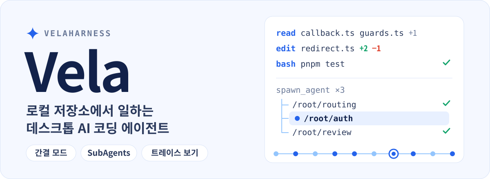

<p align="center">
  
</p>

<p align="center">
  <a href="./README.md">English</a> · <a href="./README.zh-CN.md">简体中文</a> · <a href="./README.zh-TW.md">繁體中文</a> · <a href="./README.ja.md">日本語</a> · <b>한국어</b>
</p>

<p align="center">
  <a href="#간결-모드">간결 모드</a> · <a href="#subagents">SubAgents</a> · <a href="#트레이스-보기">트레이스 보기</a> · <a href="#시작하기">시작하기</a> · <a href="#개발">개발</a>
</p>

Vela는 내 컴퓨터에 있는 저장소 안에서 AI 에이전트가 작업하는 데스크톱 앱입니다. 프로젝트를 파악하고, 작업을 나누고, 코드를 수정해 실행합니다. 진행 상황은 간결한 채팅으로 따라가고, 하위 에이전트는 별도 패널에서 추적하며, 실행 트레이스로 모든 단계를 하나씩 확인할 수 있습니다.

## 간결 모드

**도구 호출을 한 줄짜리 진행 단계로 줄여, 작업 내용이 화면의 중심에 오도록 합니다.** 간결 모드는 기본으로 켜져 있습니다. 파일 읽기, 코드 수정, 명령 실행이 각각 한 줄로 표시되고, 연속된 호출은 펼칠 수 있는 요약으로 자동 병합됩니다. 파일 이름을 클릭하면 오른쪽에 미리보기가 열리고, 수정 내역을 펼치면 diff를, 명령을 펼치면 출력을 볼 수 있습니다. 작업이 끝나면 해당 턴의 전체 과정을 접어 결과만 남길 수도 있습니다.

아래 예시는 파일 조회와 수정 요약을 펼쳐서 “문제 위치 파악 → 수정 → 범위를 좁힌 검증”의 전체 과정을 보여 줍니다.

<p align="center">
  <a href="./assets/readme/vela-compact.png"></a>
</p>

간결 표시와 카드 표시는 「설정 → 대화 표시 → 도구 호출 표시」에서 전환할 수 있습니다.

## SubAgents

**메인 에이전트가 전체를 조율하고, 하위 에이전트가 조사·구현·검토를 병렬로 수행합니다.** 사용 방식은 Codex와 같은 스타일입니다. `spawn_agent`로 작업을 나누고, `send_message`로 발견한 내용을 주고받고, `followup_task`로 추가 작업을 맡깁니다. 하위 에이전트도 자신의 하위 작업을 만들 수 있어, 경로로 구성된 에이전트 트리가 만들어집니다.

메인 채팅에는 작업 개요와 결론이 남습니다. `/root/auth` 같은 에이전트 경로를 클릭하면 해당 에이전트의 메시지, 생각, 도구 호출, 최종 결과를 오른쪽의 독립된 패널에서 볼 수 있습니다. 탭과 에이전트 목록으로 하위 작업을 전환할 수 있고, 메인 채팅과 각 에이전트 패널은 따로 스크롤됩니다.

예시에서는 로그인 문제를 `routing`(조사), `auth`(수정), `review`(경계 조건 검토)로 나누고, 오른쪽에 `auth`의 실행 흐름을 열어 두었습니다.

<p align="center">
  <a href="./assets/readme/vela-subagents.png"></a>
</p>

`explore` 하위 에이전트는 읽기 전용이고, `general` 하위 에이전트는 현재 세션의 실행 권한을 사용합니다. 새로 만든 하위 에이전트 세션은 저장되므로, 채팅을 다시 열어도 실행 기록이 복원됩니다.

## 트레이스 보기

**채팅에서 트레이스로 전환해, 에이전트가 결과에 이른 과정을 노드 단위로 확인할 수 있습니다.** 화면 구성은 DeepSeek Harness와 같은 스타일입니다. 타임라인과 이벤트 목록이 연동되어 생각, 도구 호출, 반환값, 어시스턴트 출력을 보여 줍니다. 타임라인은 소요 시간, 턴, 모델 호출 단위로 볼 수 있고, 노드를 선택하면 인수, 결과, 스키마, 타이밍을 확인할 수 있습니다.

요청 지표에는 첫 토큰까지의 지연 시간, 생성 시간, 토큰 사용량, 캐시 적중률이 포함됩니다. 초기 시스템 프롬프트와 도구 정의도 볼 수 있습니다. 이전 세션에서 기록되지 않은 지표는 “기록 안 됨”으로 표시됩니다.

예시에서는 로그인 테스트를 실행한 `bash` 호출을 선택해, 오른쪽에서 전체 반환값을, 아래쪽에서 해당 턴의 통계를 보여 줍니다.

<p align="center">
  <a href="./assets/readme/vela-trace.png"></a>
</p>

> 세 장의 스크린샷은 Vela의 실제 UI 컴포넌트에 생성한 샘플 데이터를 적용해 렌더링한 것입니다. `atlas-web` 프로젝트, 대화, 테스트 결과, 소요 시간, 토큰 지표는 설명을 위한 것이며 실제 작업 기록이나 성능 벤치마크가 아닙니다. “같은 스타일”은 사용 경험과 화면 구성을 가리키며, 어떤 제휴 관계도 뜻하지 않습니다. 스크린샷은 중국어 간체 UI입니다. Vela는 영어, 중국어 번체, 일본어, 한국어 UI도 지원합니다(「설정 → 인터페이스 → 언어」).

## 더 많은 기능

- **Agent / Plan / Goal:** 일상적인 읽기·쓰기와 실행, 먼저 계획을 세운 뒤 구현, 여러 단계로 이루어진 목표를 향한 지속적인 작업 중에서 고를 수 있습니다.
- **로컬 워크스페이스와 Git worktree:** 내 컴퓨터의 프로젝트를 열고, 원래 워크스페이스나 독립된 worktree에서 작업합니다.
- **검토와 작업 패널:** Git 변경 내용과 스테이징 상태를 확인합니다. 오른쪽 탭에는 파일 미리보기, 변경 사항, 통합 터미널이 들어가며, `⌘T`로 새 탭을 엽니다.
- **모델 및 계정:** 모델 제공자를 관리하고, 계정에 로그인하거나 API 키를 입력하거나 사용자 지정 모델 엔드포인트를 추가합니다.
- **MCP 서버:** 로컬 또는 원격 MCP 도구에 연결합니다. 전역 및 프로젝트별 설정, 필요할 때 탐색, 프로젝트 신뢰, 읽기 전용 승인을 지원합니다. 자세한 내용은 [docs/mcp.md](./docs/mcp.md)를 참고하세요.
- **프로젝트 메모리와 전역 메모리:** Markdown 파일 두 개에 프로젝트를 넘나드는 개인 선호와 현재 프로젝트의 규칙·결정 사항을 저장합니다. 실행할 때마다 자동으로 불러오며, 설정에서 보고, 편집하고, 비우거나 삭제할 수 있습니다. 자세한 내용은 [docs/memory.md](./docs/memory.md)를 참고하세요.
- **예약 작업:** 한 번, 매일, 매주 또는 Cron 표현식으로 작업을 예약합니다. 실행할 때마다 연결된 워크스페이스에서 새 채팅이 시작되며, 실행 권한, 모델, 추론 강도를 선택할 수 있습니다. 자세한 내용은 [docs/scheduled-tasks.md](./docs/scheduled-tasks.md)를 참고하세요.
- **작업 레시피:** 매개변수가 있는 작업 템플릿을 저장하고, 매개변수를 채워 미리 본 다음 새 채팅에서 시작합니다. 단계별 워크플로, 승인, 팀 공유, 버전별 효과 비교를 지원합니다. 자세한 내용은 [docs/task-recipes.md](./docs/task-recipes.md)를 참고하세요.
- **통합:** 설정에서 Notion 같은 내장 앱을 한 번에 연결합니다. URL이나 토큰을 입력할 필요가 없습니다. OAuth는 시스템 브라우저에서 완료되고, 자격 증명은 시스템 보안 저장소로 암호화됩니다. 자세한 내용은 [docs/built-in-mcp-plugins.md](./docs/built-in-mcp-plugins.md)를 참고하세요.
- **모양과 컨텍스트:** 라이트 / 다크 테마와 다섯 가지 UI 언어를 지원하며, 컨텍스트 사용량, 생각 강도, Skill 활동을 확인할 수 있습니다. 재시작 후에도 복원됩니다.
- **이미지 보기:** 메시지의 썸네일을 클릭하면 전체 화면에서 확대, 드래그, 여러 이미지 간 전환을 할 수 있습니다.

<details>
<summary>모델 및 계정, 모양 설정 스크린샷</summary>

<p align="center">
  <a href="./assets/readme/vela-model-providers.png"></a>
</p>

<p align="center">
  <a href="./assets/readme/vela-themes.png"></a>
</p>

</details>

## 시작하기

**다운로드.** [Releases 페이지](https://github.com/KryptonGao/VelaHarness/releases/latest)에서 최신 macOS(Apple Silicon) 빌드를 받으세요. `.dmg`는 설치 파일이고 `.zip`은 앱 번들이며, 체크섬은 `SHA256SUMS.txt`에 있습니다. 이 빌드는 공증되지 않았습니다. macOS가 처음 실행을 막으면 「시스템 설정 → 개인정보 보호 및 보안」에서 「그래도 열기」를 선택하세요.

**또는 소스에서 실행.** **Node.js 22.19 이상**과 **pnpm 11.24.0**(`packageManager` 필드로 고정)이 필요합니다. 저장소 루트에서 다음을 실행합니다.

```sh
pnpm install
pnpm dev
```

개발 빌드는 데이터를 `~/.vela-dev`에 저장하므로, `~/.vela`를 쓰는 설치된 `Vela.app`과 동시에 실행할 수 있습니다. 계정, 세션, 설정은 따로 저장됩니다. 설치 버전의 데이터를 동기화하는 방법과 개발자 도구는 [docs/development.md](./docs/development.md)(현재 중국어 간체)를 참고하세요.

처음 실행한 뒤에는 다음 순서로 시작합니다.

1. 「모델 및 계정」 설정에서 모델 제공자에 로그인하거나 사용자 지정 모델 엔드포인트를 추가합니다.
2. 내 컴퓨터의 프로젝트 폴더나 Git worktree를 선택합니다.
3. `Agent`, `Plan`, `Goal` 중 모드를 고르고 처리할 작업을 설명합니다.

## 권한과 로컬 데이터

- **실행 권한은 세 단계입니다.** 「매번 묻기」는 터미널 명령을 실행하기 전에 승인을 요청하고, 선택한 워크스페이스 밖에 쓸 때도 승인을 요청합니다. 「자동 승인」은 현재 채팅에서 선택한 모델이 위험도를 판단하며, 위험한 작업이거나 판단에 실패했을 때만 승인을 요청합니다. 「전체 접근」은 이러한 개별 확인을 생략합니다. 이 설정은 대화형 승인 정책이며 운영체제 수준의 샌드박스가 아닙니다.
- **로컬 실행만 지원합니다.** 현재는 로컬 워크스페이스나 Git worktree에서 실행됩니다. 원격 및 격리된 샌드박스 실행 환경은 아직 구현되지 않았습니다.
- **데이터 저장 위치.** 채팅, 모델 계정, 워크스페이스 기록, 실행 권한, 실행 트레이스는 `~/.vela`에 저장됩니다(트레이스는 `~/.vela/traces`). 개발 빌드는 `~/.vela-dev`를 사용합니다. MCP 설정과 자격 증명, 예약 작업, 작업 레시피도 여기에 저장됩니다. Electron 캐시는 시스템의 애플리케이션 지원 폴더에 그대로 남습니다.

<details>
<summary>메시지 수정과 워크스페이스 되돌리기의 범위</summary>

사용자 메시지 아래에는 전송 시각, 복사, 수정이 표시됩니다. 수정한 뒤 「다시 보내기」를 누르면 같은 채팅에서 해당 턴과 그 이후의 대화, 계획, 에이전트 기록이 취소되고, 저장된 체크포인트에서 워크스페이스 파일이 복원됩니다. 전송 전에 이미 있던 커밋되지 않은 변경 사항은 유지됩니다. 체크포인트는 이 버전부터 기록되므로, 체크포인트가 없는 이전 메시지는 되돌릴 수 없습니다. 이후 파일이 수동으로 수정되었거나 다른 채팅이 동시에 실행 중이면 되돌리기가 차단됩니다. Git 인덱스와 커밋, 무시된 의존성 및 빌드 폴더, 워크스페이스 밖의 파일, 외부 서비스에 대한 작업은 되돌리기 범위에 포함되지 않습니다.

</details>

**Skills.** 사용자 Skill은 `~/.vela/skills`에 둡니다. 현재 워크스페이스의 `.pi/skills`와 `.agents/skills`, 그리고 `~/.agents/skills`도 함께 불러오며, 이름이 같으면 프로젝트의 Skill이 우선합니다. Skill은 `name`과 `description`이 있는 `SKILL.md`가 들어 있는 폴더입니다.

```markdown
---
name: pdf-tools
description: PDF에서 텍스트와 표를 추출합니다. PDF를 읽거나 변환하거나 검사할 때 사용합니다.
---

# PDF tools

파일을 처리하기 전에 이 폴더의 설명을 먼저 읽으세요.
```

새 채팅은 기본적으로 불러온 Skill의 이름, 설명, 파일 경로만 나열하고, 필요할 때 전체 내용을 읽습니다. `/skill:이름`을 입력하면 해당 Skill을 바로 펼칠 수 있습니다. 설정의 Agent 페이지에는 현재 불러온 Skill이 나열되며, 하나씩 비활성화할 수 있고 `~/.vela/skills`에 있는 Skill은 삭제할 수도 있습니다(비활성화 기록은 `~/.vela/skill-preferences.json`에 저장되며 다른 폴더의 파일에는 영향을 주지 않습니다).

## 개발

```sh
pnpm dev         # Electron 개발 환경 시작
pnpm build       # 데스크톱 앱 빌드
pnpm typecheck   # TypeScript 타입 검사
pnpm test        # 타입 검사 + 전체 단위 테스트(PR의 CI와 동일)
pnpm test:ui     # 실제 Electron 렌더러에서 UI 검사
pnpm test:smoke  # 빌드 후 Electron 스모크 테스트 실행(CI에서는 매일 밤과 태그를 달 때 실행)
pnpm test:center # 테스트 센터: Node 단위 테스트와 브라우저 UI 검사를 로컬 웹 대시보드에서 실행
```

주요 기능 스크린샷의 샘플 데이터, 미리보기 주소, 다시 촬영하는 방법은 [스크린샷 안내](./assets/readme/README.md)(현재 중국어 간체)에 있습니다. 미리보기 페이지는 실제 UI 컴포넌트를 재사용하며 모델을 호출하지 않습니다. 히어로 이미지는 [`assets/readme/source/build-hero.py`](./assets/readme/source/build-hero.py)로 생성합니다.

| 단축키 | 동작 |
| --- | --- |
| `⌘B` / `Ctrl+B` | 왼쪽 사이드바 접기 / 펼치기 |
| `⌘J` / `Ctrl+J` | 오른쪽 사이드바 접기 / 펼치기 |
| `⌘,` / `Ctrl+,` | 설정 열기 / 닫기 |
| `⌘N` / `Ctrl+N` | 새 채팅 |
| `⌘T` / `Ctrl+T` | 오른쪽 작업 패널에서 새 탭 열기 |
| `Enter` | 메시지 전송 |
| `Shift+Enter` | 줄 바꿈 |

### 프로젝트 구조

- `apps/desktop`: Electron 메인 프로세스, preload, React UI.
- `packages/agent`: Pi 세션 런타임, 모델 카탈로그, 상호작용 모드, 컨텍스트 통계.
- `packages/workspace`: 워크스페이스, worktree, Git, Pull Request, 권한 승인.
- `packages/shared`: 메인 프로세스와 UI가 공유하는 타입과 IPC 정의.
- `packages/tools`: 에이전트 내장 도구 카탈로그.
- `docs/`: Plan 모드, MCP, 메모리, 예약 작업, 작업 레시피 등의 주제별 문서(현재 중국어 간체). 시작점은 [docs/README.md](./docs/README.md)입니다.

## 기술 세부 사항

Vela는 [Pi Agent](https://github.com/earendil-works/pi)를 기반으로 만들어졌으며, TypeScript SDK를 통해 에이전트 런타임을 데스크톱 앱에 내장합니다. Pi가 모델 인터페이스, 세션, 도구 런타임을 제공하고, Vela가 그 위에 데스크톱 UI, 작업 모드, 권한 승인, Git 워크스페이스 통합을 구현합니다.

- **기술 스택:** Electron 44, electron-vite, React 19, TypeScript. 데스크톱 앱과 공유 패키지는 pnpm workspace로 관리합니다. Pi는 `1.0.0`(`@earendil-works/pi-coding-agent`, `pi-agent-core`, `pi-ai`)으로 정확히 고정되어 있습니다. Vela는 메인 프로세스에서 `createAgentSession()`을 호출하며, Pi 명령줄 프로그램을 실행해 에이전트를 구동하지 않습니다. 자세한 내용은 [Pi 1.0 마이그레이션 기록](./docs/pi-1.0-migration.md)을 참고하세요.
- **세션과 모델:** 채팅마다 독립된 Pi `AgentSession`을 사용합니다. 메시지는 `~/.vela/sessions`에, 채팅 인덱스는 `~/.vela/conversations.json`에 저장됩니다. 제공자와 모델은 Pi의 `ModelRuntime`으로 불러오며, Vela 고유의 `~/.vela` 설정을 사용하고 로컬 Pi 설정은 읽지 않습니다.
- **도구, 모드, 권한:** 기본 도구는 Pi의 `read`, `bash`, `edit`, `write`이며, Vela는 승인을 연결하기 위해 `bash`, `edit`, `write`를 감쌉니다. `Plan` 모드는 ToolPolicy로 편집과 쓰기를 막고 읽기 전용 명령만 허용하며, 전체 계획을 `<proposed_plan>`으로 출력합니다. 승인하면 현재 컨텍스트나 새 컨텍스트에서 실행할 수 있습니다. `Goal` 모드는 `update_goal`로 진행 상황을 기록합니다. 자세한 내용은 [docs/plan-mode.md](./docs/plan-mode.md)와 [docs/plan-mode-architecture.md](./docs/plan-mode-architecture.md)를 참고하세요.
- **MCP:** 도구는 기본적으로 `tool_search`를 통해 필요할 때 탐색되며, 직접 제공하거나 숨기도록 설정할 수도 있습니다. 프로젝트 설정은 신뢰 확인이 필요합니다. Plan 모드와 `explore` 하위 에이전트에는 읽기 전용으로 확인된 도구만 제공됩니다.
- **워크스페이스와 프로세스:** Git worktree는 로컬 Git 명령으로 만들어지며, `~/.vela/worktrees` 아래에 독립된 `vela/wt-*` 브랜치로 놓입니다. Pull Request 정보는 설치되어 있고 로그인된 GitHub CLI(`gh`)로 읽어 옵니다. 에이전트, 파일 시스템, Git 작업은 Electron 메인 프로세스가 처리하고, renderer는 preload의 IPC로 호출합니다. 창은 `contextIsolation`을 켜고 `nodeIntegration`을 끈 상태로 실행됩니다.

## 라이선스

[Apache-2.0](./LICENSE)
