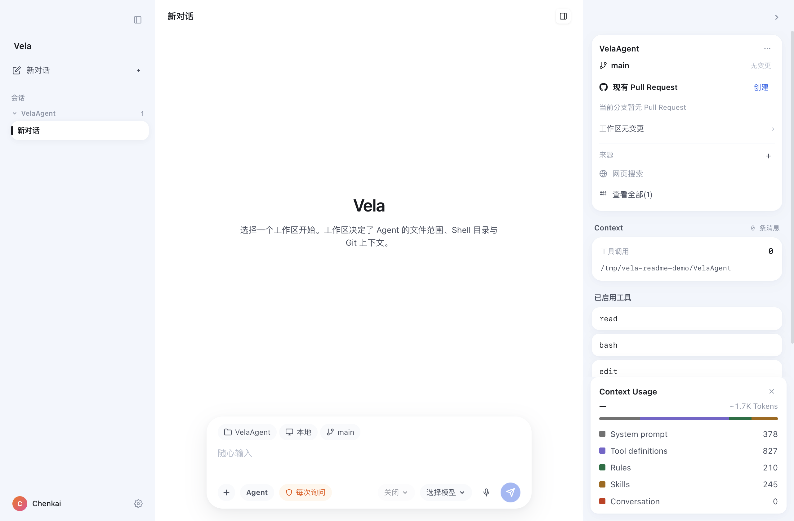

# Vela

**在你选定的代码仓库中工作的桌面 AI 编程助手。**

让 Agent 理解项目、整理计划、修改和运行代码；你可以在同一窗口查看执行记录、Git 改动与权限请求。

<p align="center">
  
</p>

[快速开始](#快速开始) · [工作方式](#工作方式) · [权限与本地数据](#权限与本地数据) · [开发指南](#开发指南)

## 工作方式

- **按任务选择模式：** `Agent` 负责日常读写与执行；`Plan` 只读查阅代码并提交计划，确认后再执行；`Goal` 记录多步目标与进度，持续推进直到完成。
- **在真实工作区中操作：** 打开本机项目目录，或使用独立的 Git worktree。工作区决定 Agent 的文件范围、Shell 目录和 Git 上下文。
- **随时检查改动：** 查看工具调用和结果、Git 差异与暂存状态，并查看或创建当前分支的 Pull Request。
- **保留工作上下文：** 会话会在应用重启后恢复；模型、思考强度、上下文用量和 Skill 活动都能在界面中查看。

## 快速开始

仓库当前提供从源码启动的方式。需要 **Node.js 22.19 或更高版本**和 **pnpm 11.24.0**（版本由 `packageManager` 字段固定）。在仓库根目录运行：

```sh
pnpm install
pnpm dev
```

首次启动后：

1. 在「模型与账号」设置中登录一个模型提供方，或添加自定义模型接口。
2. 选择本机项目目录或 Git worktree。
3. 选择 `Agent`、`Plan` 或 `Goal` 模式，描述要完成的任务。

## 权限与本地数据

- 默认的「每次询问」模式会在运行终端命令前请求批准；写入所选工作区之外的位置也会请求批准。「完全访问」模式会跳过这些逐项确认。这里的权限设置是交互式审批策略，不是操作系统级沙箱。
- 当前支持在本机工作区或 Git worktree 中运行；远程和隔离沙箱执行环境尚未实现。
- 对话、模型账号、工作区记录和执行权限保存在 `~/.vela`。macOS 上对应 `/Users/<用户名>/.vela`；Electron 缓存仍保存在系统的应用支持目录。

用户 Skill 放在 `~/.vela/skills`。当前工作区的 `.pi/skills`、`.agents/skills` 和 `~/.agents/skills` 也会加载；同名时项目中的 Skill 优先。每个 Skill 是一个包含 `name` 和 `description` 的 `SKILL.md` 文件夹：

```markdown
---
name: pdf-tools
description: 从 PDF 提取文字和表格。在阅读、转换或检查 PDF 时使用。
---

# PDF tools

先阅读本目录里的说明，再处理文件。
```

新对话默认只列出已加载 Skill 的名称、描述和文件路径，需要时再读取全文。输入 `/skill:名称` 可以直接展开 Skill；设置中的 Agent 页面会列出当前已加载的 Skill。

## 开发指南

```sh
pnpm dev         # 启动 Electron 开发环境
pnpm build       # 编译桌面端代码
pnpm typecheck   # 检查 TypeScript 类型
```

| 快捷键 | 操作 |
| --- | --- |
| `⌘B` / `Ctrl+B` | 折叠或展开左侧栏 |
| `⌘J` / `Ctrl+J` | 折叠或展开右侧栏 |
| `⌘,` / `Ctrl+,` | 打开或关闭设置 |
| `Enter` | 发送消息 |
| `Shift+Enter` | 输入换行 |

## 项目结构

- `apps/desktop` — Electron 主进程、preload 与 React 界面。
- `packages/agent` — Pi 会话运行时、模型目录、交互模式与上下文统计。
- `packages/workspace` — 工作区、worktree、Git、Pull Request 与权限审批。
- `packages/shared` — 主进程与界面共享的类型和 IPC 定义。
- `packages/tools` — Agent 内置工具目录。

## 技术细节

Vela 基于 [Pi Agent](https://github.com/earendil-works/pi) 构建，并通过 TypeScript SDK 将 Agent 运行时嵌入桌面应用。Pi 提供模型接口、会话和工具运行时；Vela 在其上实现桌面界面、任务模式、权限审批以及 Git 工作区集成。

### 技术栈

- **桌面端：** Electron 44、electron-vite、React 19 和 TypeScript；pnpm workspace 管理桌面应用及共享包。
- **Pi Agent：** `@earendil-works/pi-coding-agent`、`@earendil-works/pi-agent-core` 和 `@earendil-works/pi-ai`（`^0.87.1`）。Vela 在主进程调用 `createAgentSession()` 创建会话，不通过启动 Pi 命令行程序来运行 Agent。

### Agent 会话与模型

- 每个对话使用独立的 Pi `AgentSession`，会话消息保存在 `~/.vela/sessions`，对话索引保存在 `~/.vela/conversations.json`；启动后可重新打开历史会话。
- 模型目录通过 Pi 的 `ModelRuntime` 加载提供方和模型。Vela 使用自己的 `~/.vela` 配置，不读取本机 Pi 配置；提供方凭据和自定义模型分别保存在应用数据目录的 `auth.json` 与 `models.json`。
- Pi 的 `DefaultResourceLoader` 负责加载会话资源；Vela 为其附加模式扩展和用户指令，并将会话事件转成界面可展示的文本、思考状态和工具活动。

### 工具、模式与权限

- 基础工具为 Pi 的 `read`、`bash`、`edit` 和 `write`。Vela 包装 `bash`、`edit`、`write`：默认权限模式下，Shell 命令逐条请求批准，工作区外的文件修改也需要批准；工作区内读写不逐项拦截。
- `Plan` 模式通过 Pi 工具调用钩子禁止文件编辑和写入，并只放行只读命令；`submit_plan` 与 `ask_user_question` 将计划交给用户确认。`Goal` 模式通过 `update_goal` 记录进度与完成状态。
- Agent 可调用 `task` 启动子会话。`explore` 子任务只读；`general` 子任务使用当前会话的权限，并在内存会话中运行。

### 工作区与 Electron 进程

- Git worktree 由本地 Git 命令创建，放在 `~/.vela/worktrees` 下，并使用独立的 `vela/wt-*` 分支。Git 状态和差异由 `packages/workspace` 提供给界面。
- Pull Request 信息可通过已安装并登录的 GitHub CLI（`gh`）读取；创建 Pull Request 时，Vela 打开 GitHub compare 页面。
- Agent、文件系统和 Git 操作由 Electron 主进程处理。renderer 通过 preload 暴露的 IPC API 调用这些能力；窗口启用 `contextIsolation`，并关闭 `nodeIntegration`。

## 许可证

[Apache-2.0](./LICENSE)
