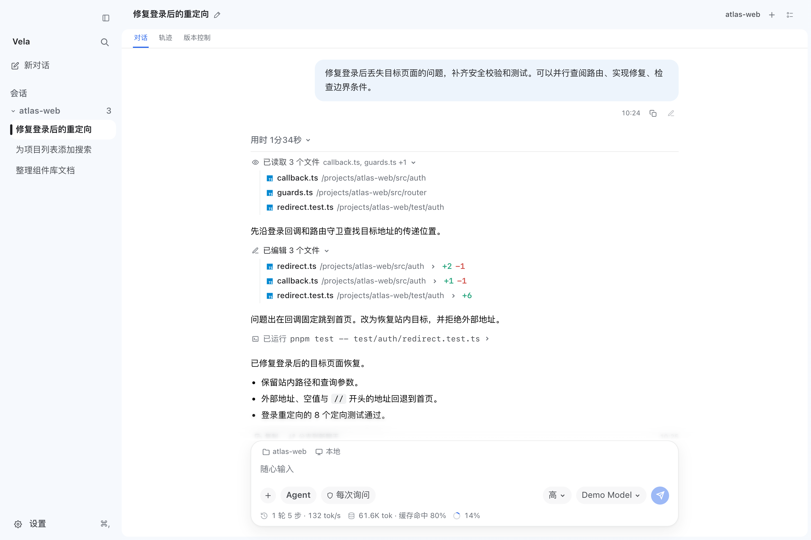
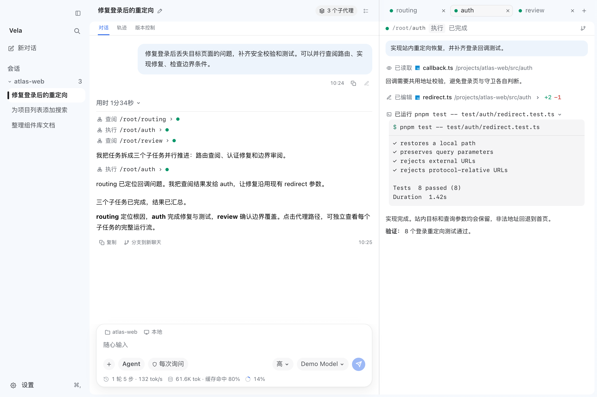
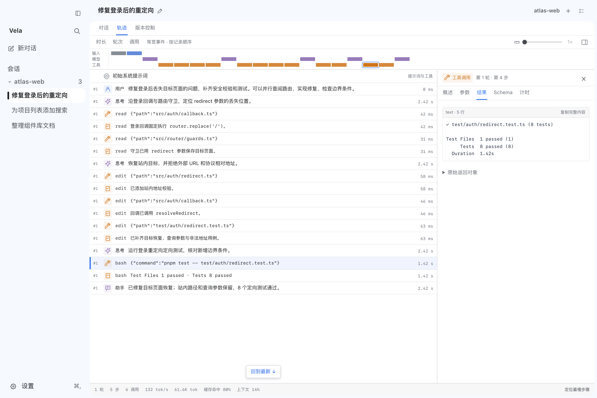
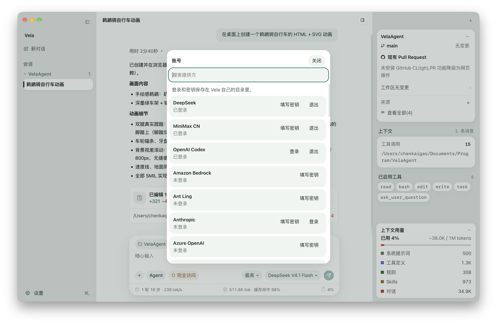
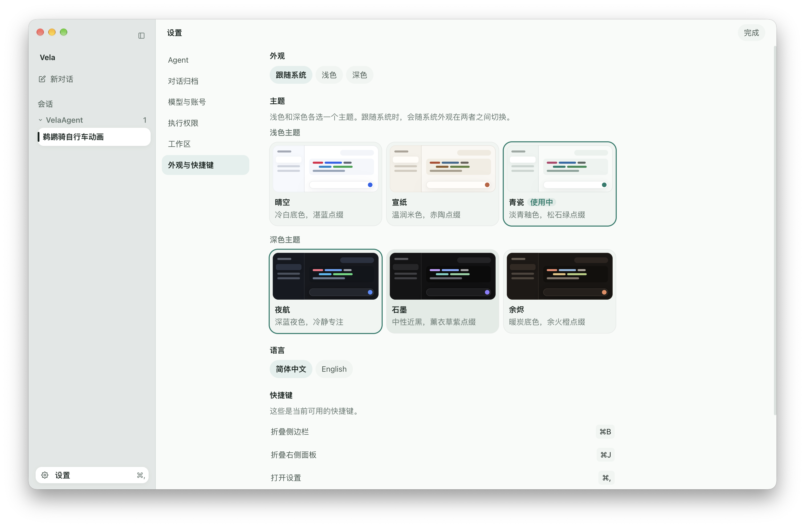

# Vela

**在本地代码仓库中工作的桌面 AI 编程助手。**

**紧凑模式 · Codex 同款 SubAgents · DeepSeek Harness 同款轨迹界面**

让 Agent 理解项目、拆分任务、修改并运行代码；用紧凑对话查看进度，用独立面板跟踪子代理，用执行轨迹检查每一步。

[紧凑模式](#紧凑模式) · [SubAgents](#codex-同款-subagents) · [轨迹界面](#deepseek-harness-同款轨迹界面) · [快速开始](#快速开始) · [开发指南](#开发指南)

## 紧凑模式

**把工具调用收成过程行，让任务内容占据主要视野。** 紧凑模式默认开启：读文件、改代码和运行命令以单行呈现，连续调用自动合并为可展开的摘要。点击文件名打开右侧预览，展开改动查看 diff，展开命令查看输出；完成后还可以收起整轮过程，只保留结果。

下面的示例展开了文件查阅和修改摘要，展示“定位问题 → 实施修复 → 定向验证”的完整过程。

<p align="center">
  <a href="./assets/readme/vela-compact.png"></a>
</p>

在「设置 → 外观与快捷键 → 工具显示」中，可切换紧凑与卡片两种展示方式。

## Codex 同款 SubAgents

**主代理统筹，子代理并行查阅、实现和审阅。** 用 `spawn_agent` 拆分任务，用 `send_message` 交换发现，用 `followup_task` 继续分派工作；子代理也可以创建自己的子任务，形成按路径组织的代理树。

主对话保留任务概况与结论，点击 `/root/auth` 这样的代理路径，就能在右侧独立查看它的消息、思考、工具调用和最终结果。标签页与代理列表支持切换子任务，主对话和子代理面板各自滚动。

示例把登录问题拆成 `routing` 查阅、`auth` 修复和 `review` 边界审阅，右侧打开 `auth` 的运行流。

<p align="center">
  <a href="./assets/readme/vela-subagents.png"></a>
</p>

`explore` 子代理只读查阅；`general` 子代理使用当前会话的执行权限。新创建的子代理会话会持久化，重开聊天后可恢复运行记录。

## DeepSeek Harness 同款轨迹界面

**从对话切到轨迹，逐节点检查 Agent 如何得出结果。** 时间轴与事件列表联动展示思考、工具调用、返回和助手输出；支持按时长、轮次或模型调用查看时间轴，选中节点即可检查参数、结果、Schema 与计时。

请求指标包括首 Token 延迟、生成耗时、Token 用量和缓存命中率；初始系统提示词与工具定义也可以查看。旧会话缺失的指标会标为未记录。

示例选中登录测试的 `bash` 调用，在右侧查看完整返回，并在底部查看本轮统计。

<p align="center">
  <a href="./assets/readme/vela-trace.png"></a>
</p>

> 三张截图均由 Vela 的真实界面组件配合生成的示例数据渲染。`atlas-web` 项目、对话、测试结果、耗时与 Token 指标用于展示，不代表真实任务记录或性能基准。“同款”描述交互体验与界面组织方式。

## 更多工作能力

- **Agent / Plan / Goal：** 日常读写执行、先制定方案再实施，或围绕多步目标持续推进。
- **本地工作区与 Git worktree：** 打开本机项目，在原工作区或独立 worktree 中处理任务。
- **审阅与工作面板：** 查看 Git 差异和暂存状态；右侧标签页承载文件预览、变更与集成终端，`⌘T` 新建标签页。
- **模型与账号：** 管理模型提供方，登录账号、填写 API 密钥或添加自定义模型接口。
- **MCP 服务器：** 连接本机或远程 MCP 工具，支持全局与项目配置、按需发现、项目信任和只读授权。详细说明见 [docs/mcp.md](./docs/mcp.md)。
- **项目记忆与全局记忆：** 用两个 Markdown 文件保存跨项目的个人偏好和当前项目的约定、决策；每次执行前自动加载，用户可在设置中查看、编辑、清空或删除。详细说明见 [docs/memory.md](./docs/memory.md)。
- **定时任务：** 在侧栏页面或对话里按一次、每日、每周或 Cron 时间安排任务，每次执行在绑定工作区的新对话中运行，可选择执行权限、模型与推理强度。详细说明见 [docs/scheduled-tasks.md](./docs/scheduled-tasks.md)。
- **任务配方：** 保存参数化任务模板，填写参数并预览后在选定工作区的新对话中启动；支持 Agent / Plan、版本快照、使用记录、AI 整理、项目库与导入导出、Skill 依赖、定时绑定及独立 worktree，以及结构化阶段、条件分支、审批与受控重试、Git／目录团队共享和本机版本效果比较。详细说明与边界见 [docs/task-recipes.md](./docs/task-recipes.md)。
- **集成：** 在设置中一键连接 Notion 等内置应用，无需填写 URL 或 Token；OAuth 在系统浏览器完成，凭据由系统安全存储加密。详细说明见 [docs/built-in-mcp-plugins.md](./docs/built-in-mcp-plugins.md)。
- **外观与上下文：** 切换浅色 / 深色主题和中英文界面，查看上下文用量、思考强度与 Skill 活动；会话重启后可恢复。
- **图片查看：** 点击消息缩略图，全屏缩放、拖动和切换多张图片。

<details>
<summary>查看模型与账号、外观设置截图</summary>

<p align="center">
  <a href="./assets/readme/vela-model-providers.png"></a>
</p>

<p align="center">
  <a href="./assets/readme/vela-themes.png"></a>
</p>

</details>

## 快速开始

仓库当前提供从源码启动的方式。需要 **Node.js 22.19 或更高版本**和 **pnpm 11.24.0**（版本由 `packageManager` 字段固定）。在仓库根目录运行：

```sh
pnpm install
pnpm dev
```

开发版使用独立的 `~/.vela-dev` 资料目录和 Electron 配置，可与已安装的 `Vela.app` 同时运行；安装版继续使用 `~/.vela`。两者的账号、会话、设置和定时任务分别保存，首次启动开发版需单独配置账号。可通过 `VELA_USER_DATA` 指定其他资料目录，同一资料目录仍只允许一个实例运行。

开发版的「设置 → 开发工具 → 同步正式版会话」可从 `~/.vela` 复制新会话，包括消息、计划、子代理历史、轨迹与文件检查点。已有会话会跳过，同步后侧栏立即更新，当前会话保持打开。正式版仍可运行，复制的历史会独立保存在开发版资料目录。

首次启动后：

1. 在「模型与账号」设置中登录一个模型提供方，或添加自定义模型接口。
2. 选择本机项目目录或 Git worktree。
3. 选择 `Agent`、`Plan` 或 `Goal` 模式，描述要完成的任务。

可在「设置 → 外观与快捷键 → 思考总结」开启自动总结（默认关闭）。「思考总结模型」默认跟随当前对话，也可选择独立模型（包括在「模型与账号」中配置的自定义模型），选择会在重启后保留。新完成的思考会生成摘要，语言跟随界面设置；历史思考可点击「总结」手动生成。模型更改仅对新生成的总结生效，已有总结会保留。每段总结会额外调用模型，不写入聊天上下文。

已完成的思考总结和界面设置保存在资料目录的 `ui-state.json`（安装版默认 `~/.vela`，开发版默认 `~/.vela-dev`，可用 `VELA_USER_DATA` 覆盖），退出后重开会恢复。首次读取时会迁移当前页面原有的本地存储数据。

每轮回复的用时由主进程记录，随会话保存在 `sessions/*.jsonl`，重开和分支聊天后仍可查看。旧历史未记录的用时会显示「耗时未记录」。归档状态保存在 `conversations.json`，归档和取消归档会立即写盘；左右面板及工作区分组的折叠状态也随界面设置保存。

## 权限与本地数据

<details>
<summary>修改消息与工作区回退的范围</summary>

用户消息气泡下方提供发送时间、复制和修改。修改后点「重新发送」，会在同一聊天中撤回该轮及后续对话、计划和代理记录，并从持久化检查点恢复工作区文件；发送前已有的未提交改动会保留。检查点从本版本起记录，旧消息没有检查点时会提示无法回退；文件存在后续手动改动或其他聊天同时执行时会阻止回退。回退范围不包括 Git 索引/提交、忽略的依赖与构建目录、工作区外文件或外部服务操作。

</details>

- 执行权限分三档：「每次询问」在运行终端命令前请求批准，写入所选工作区之外的位置也会请求批准；「帮我批准」由当前对话选择的模型判断风险，只有风险操作或判断失败时才请求批准；「完全访问」跳过这些逐项确认。这里的权限设置是交互式审批策略，不是操作系统级沙箱。
- 当前支持在本机工作区或 Git worktree 中运行；远程和隔离沙箱执行环境尚未实现。
- 对话、模型账号、工作区记录、执行权限和执行轨迹保存在 `~/.vela`（轨迹写入 `~/.vela/traces`）。macOS 上对应 `/Users/<用户名>/.vela`；Electron 缓存仍保存在系统的应用支持目录。MCP 配置与凭据也保存在这里（`mcp.json`、`mcp-auth.json`、`mcp-policy.json` 和 `mcp.log`），项目服务器还使用工作区内的 `.pi/mcp.json`；内置集成使用 `integrations.json` 与 `integrations-auth.enc.json`，定时任务保存在 `scheduled-tasks.json`，任务配方与使用快照保存在 `task-recipes.json`。

用户 Skill 放在 `~/.vela/skills`。当前工作区的 `.pi/skills`、`.agents/skills` 和 `~/.agents/skills` 也会加载；同名时项目中的 Skill 优先。每个 Skill 是一个包含 `name` 和 `description` 的 `SKILL.md` 文件夹：

```markdown
---
name: pdf-tools
description: 从 PDF 提取文字和表格。在阅读、转换或检查 PDF 时使用。
---

# PDF tools

先阅读本目录里的说明，再处理文件。
```

新对话默认只列出已加载 Skill 的名称、描述和文件路径，需要时再读取全文。输入 `/skill:名称` 可以直接展开 Skill；设置中的 Agent 页面会列出当前已加载的 Skill，可以逐个停用，也可以删除 `~/.vela/skills` 里的 Skill（停用记录在 `~/.vela/skill-preferences.json`，不影响其他目录里的文件）。

## 开发指南

```sh
pnpm dev         # 启动 Electron 开发环境
pnpm build       # 编译桌面端代码
pnpm typecheck   # 检查 TypeScript 类型
pnpm test        # 类型检查 + 全部单元测试（与 PR 上的 CI 一致）
pnpm test:ui     # 真实 Electron 渲染层 UI 检查
pnpm test:smoke  # 构建后跑 Electron 冒烟测试（CI 上每晚和打 tag 时跑）
pnpm test:center # 测试中心：统一运行 Node 单测与浏览器 UI 检查（本地网页看板）
pnpm --filter @vela/desktop test:trace  # 轨迹采集与显示逻辑的定向测试
pnpm --filter @vela/desktop test:trace:preview  # 确定性 UI 测试页面（非生产数据）
```

主打功能截图的示例数据、预览地址与重拍步骤见 [截图说明](./assets/readme/README.md)。预览页面复用实际界面组件，不调用模型。

安装依赖时，`postinstall` 会把 Electron 开发二进制改名为 `Vela.app`、修改其应用名并重新签名（`scripts/brand-electron-dev.mjs`，仅 macOS），这样菜单栏和 Dock 显示的就是 Vela 的名字和图标，而不是 Electron 的默认模板。应用图标 `apps/desktop/resources/icon.png` 由 `scripts/generate-app-icon.py` 从 `assets/icon/VelaHarnessIcon.png` 生成（圆角与留白按 macOS 图标网格加工），更换原图后重跑该脚本即可。

| 快捷键 | 操作 |
| --- | --- |
| `⌘B` / `Ctrl+B` | 折叠或展开左侧栏 |
| `⌘J` / `Ctrl+J` | 折叠或展开右侧栏 |
| `⌘,` / `Ctrl+,` | 打开或关闭设置 |
| `⌘N` / `Ctrl+N` | 新建会话 |
| `⌘T` / `Ctrl+T` | 在右侧工作面板打开新标签页 |
| `Enter` | 发送消息 |
| `Shift+Enter` | 输入换行 |

## 项目结构

- `apps/desktop` — Electron 主进程、preload 与 React 界面。
- `packages/agent` — Pi 会话运行时、模型目录、交互模式与上下文统计。
- `packages/workspace` — 工作区、worktree、Git、Pull Request 与权限审批。
- `packages/shared` — 主进程与界面共享的类型和 IPC 定义。
- `packages/tools` — Agent 内置工具目录。
- `docs/` — 专题文档：Plan 模式、MCP、项目与全局记忆、定时任务、任务配方等能力的使用说明与实现细节。

## 技术细节

Vela 基于 [Pi Agent](https://github.com/earendil-works/pi) 构建，并通过 TypeScript SDK 将 Agent 运行时嵌入桌面应用。Pi 提供模型接口、会话和工具运行时；Vela 在其上实现桌面界面、任务模式、权限审批以及 Git 工作区集成。

### 技术栈

- **桌面端：** Electron 44、electron-vite、React 19 和 TypeScript；pnpm workspace 管理桌面应用及共享包。
- **Pi Agent：** `@earendil-works/pi-coding-agent`、`@earendil-works/pi-agent-core` 和 `@earendil-works/pi-ai`（精确锁定 `1.0.0`）。Vela 在主进程调用 `createAgentSession()` 创建会话，不通过启动 Pi 命令行程序来运行 Agent。迁移依据、验证范围及未验证项见 [Pi 1.0 迁移记录](docs/pi-1.0-migration.md)。

### Agent 会话与模型

- 每个对话使用独立的 Pi `AgentSession`，会话消息保存在 `~/.vela/sessions`，对话索引保存在 `~/.vela/conversations.json`；启动后可重新打开历史会话。
- 模型目录通过 Pi 的 `ModelRuntime` 加载提供方和模型。Vela 使用自己的 `~/.vela` 配置，不读取本机 Pi 配置；提供方凭据和自定义模型分别保存在应用数据目录的 `auth.json` 与 `models.json`。
- Pi 的 `DefaultResourceLoader` 负责加载会话资源；Vela 为其附加模式扩展和用户指令，并将会话事件转成界面可展示的文本、思考状态和工具活动。

### 工具、模式与权限

- 基础工具为 Pi 的 `read`、`bash`、`edit` 和 `write`。Vela 包装 `bash`、`edit`、`write`：默认权限模式下，Shell 命令逐条请求批准，工作区外的文件修改也需要批准；工作区内读写不逐项拦截。
- `Plan` 模式通过 ToolPolicy 禁止文件编辑和写入，并只放行只读命令；模型以 `<proposed_plan>` 输出完整实施方案，每次修改生成新 revision，批准后可在当前或全新上下文执行，并用 `update_plan` 跟踪执行进度。`Goal` 模式通过 `update_goal` 记录进度与完成状态。详细行为与实现见 [docs/plan-mode.md](./docs/plan-mode.md) 与 [docs/plan-mode-architecture.md](./docs/plan-mode-architecture.md)。
- SubAgents 通过 `spawn_agent`、`send_message` 和 `followup_task` 创建、通信与继续执行常驻子代理，支持嵌套任务。`explore` 子任务只读；`general` 子任务使用当前会话的权限，独立消息与运行记录会持久化。
- MCP 工具默认通过 `tool_search` 按需发现，也可以设为直接提供或隐藏；项目配置需要确认信任。用户可以把具体工具确认为只读；Plan 和 `explore` 只提供明确授权的只读 MCP 工具与资源工具。未确认只读的 MCP 调用沿用当前执行权限，并在审批中显示服务器、工具和脱敏参数。详细说明见 [docs/mcp.md](./docs/mcp.md)。

### 工作区与 Electron 进程

- Git worktree 由本地 Git 命令创建，放在 `~/.vela/worktrees` 下，并使用独立的 `vela/wt-*` 分支。Git 状态和差异由 `packages/workspace` 提供给界面。
- Pull Request 信息可通过已安装并登录的 GitHub CLI（`gh`）读取；创建 Pull Request 时，Vela 打开 GitHub compare 页面。
- Agent、文件系统和 Git 操作由 Electron 主进程处理。renderer 通过 preload 暴露的 IPC API 调用这些能力；窗口启用 `contextIsolation`，并关闭 `nodeIntegration`。

## 许可证

[Apache-2.0](./LICENSE)
