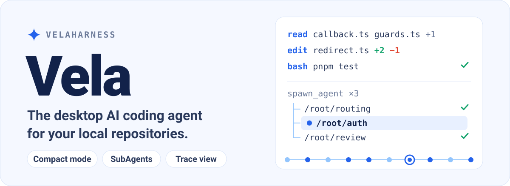

<p align="center">
  
</p>

<p align="center">
  <b>English</b> · <a href="./README.zh-CN.md">简体中文</a> · <a href="./README.zh-TW.md">繁體中文</a> · <a href="./README.ja.md">日本語</a> · <a href="./README.ko.md">한국어</a>
</p>

<p align="center">
  <a href="#compact-mode">Compact mode</a> · <a href="#subagents">SubAgents</a> · <a href="#trace-view">Trace view</a> · <a href="#get-started">Get started</a> · <a href="#develop">Develop</a>
</p>

Vela is a desktop app where an AI agent works inside a repository on your machine: it reads the project, splits up the task, edits code and runs commands. Follow progress in a compact chat, track sub-agents in their own panel, and check every step in the execution trace.

## Compact mode

**Tool calls collapse into one-line steps, so the task itself stays in view.** Compact mode is on by default. Reading a file, editing code and running a command each take a single line, and consecutive calls merge into an expandable summary. Click a file name to preview it on the right, expand an edit to see the diff, expand a command to see its output. When a turn is done, fold the whole process and keep only the result.

The example below expands the file reads and the edit summary: locate the problem, apply the fix, run a targeted check.

<p align="center">
  <a href="./assets/readme/vela-compact.png"></a>
</p>

Switch between compact and card display in **Settings → Conversation display → Tool call display**.

## SubAgents

**The main agent coordinates; sub-agents read, implement and review in parallel**, in the style of Codex. Split work with `spawn_agent`, exchange findings with `send_message`, and hand out more work with `followup_task`. A sub-agent can create sub-tasks of its own, which forms a tree of agents organised by path.

The main chat keeps the overview and the conclusion. Click an agent path such as `/root/auth` to open its messages, thinking, tool calls and final result in a separate panel on the right. Tabs and an agent list switch between sub-tasks, and the main chat and each agent panel scroll independently.

In the example, a login bug is split into `routing` (read), `auth` (fix) and `review` (edge cases), with the `auth` run open on the right.

<p align="center">
  <a href="./assets/readme/vela-subagents.png"></a>
</p>

`explore` sub-agents are read-only; `general` sub-agents use the current session's permissions. Sub-agent sessions are persisted, so their run history comes back when you reopen the chat.

## Trace view

**Switch from the chat to the trace and check, node by node, how the agent reached its result**, in the style of DeepSeek Harness. A timeline and an event list move together and show thinking, tool calls, results and assistant output. View the timeline by duration, by turn or by model call, then select a node to inspect its arguments, result, schema and timing.

Request metrics cover time to first token, generation time, token usage and cache hit rate. The initial system prompt and tool definitions are viewable too. Metrics that older sessions never recorded are marked as not recorded.

In the example, the `bash` call that ran the login test is selected: its full output is on the right and the turn's statistics are at the bottom.

<p align="center">
  <a href="./assets/readme/vela-trace.png"></a>
</p>

> All three screenshots are rendered from Vela's real interface components with generated sample data. The `atlas-web` project, the conversations, test results, timings and token metrics are for illustration only; they are not real task records or performance benchmarks. They show the Simplified Chinese interface; Vela also ships in English, Traditional Chinese, Japanese and Korean (**Settings → Interface → Language**). "In the style of" describes the interaction and layout, not any affiliation.

## More you can do

- **Agent / Plan / Goal:** everyday read-write work, plan first and then implement, or keep going toward a multi-step goal.
- **Local workspaces and Git worktrees:** open a project on your machine and work in place or in a separate worktree.
- **Review and work panel:** inspect Git diffs and staged changes; the right-hand tabs hold file previews, changes and an integrated terminal (`⌘T` opens a new tab).
- **Models and accounts:** sign in to a model provider, enter an API key or add a custom model endpoint.
- **MCP servers:** connect local or remote MCP tools, with global and per-project configuration, on-demand discovery, project trust and read-only authorisation. See [docs/mcp.md](./docs/mcp.md).
- **Project and global memory:** two Markdown files hold your cross-project preferences and the current project's conventions and decisions. They load before every run, and you can view, edit, clear or delete them in Settings. See [docs/memory.md](./docs/memory.md).
- **Scheduled tasks:** schedule a task once, daily, weekly or with a cron expression. Each run starts a new chat in the bound workspace with the permissions, model and reasoning effort you chose. See [docs/scheduled-tasks.md](./docs/scheduled-tasks.md).
- **Task recipes:** save parameterised task templates, fill in the parameters, preview and launch them in a new chat. Staged workflows, approvals, team sharing and version comparison are supported. See [docs/task-recipes.md](./docs/task-recipes.md).
- **Integrations:** connect built-in apps such as Notion in one click, with no URL or token to fill in. OAuth completes in your system browser and credentials are encrypted by system secure storage. See [docs/built-in-mcp-plugins.md](./docs/built-in-mcp-plugins.md).
- **Appearance and context:** light and dark themes, five interface languages, context usage, thinking effort and Skill activity, all restored after a restart.
- **Image viewer:** click a message thumbnail to zoom, drag and flip through images full screen.

<details>
<summary>Screenshots: model providers and appearance settings</summary>

<p align="center">
  <a href="./assets/readme/vela-model-providers.png"></a>
</p>

<p align="center">
  <a href="./assets/readme/vela-themes.png"></a>
</p>

</details>

## Get started

**Download.** Get the latest macOS (Apple Silicon) build from the [Releases page](https://github.com/KryptonGao/VelaHarness/releases/latest): the `.dmg` is the installer and the `.zip` is the app bundle, with checksums in `SHA256SUMS.txt`. The build is not notarized; if macOS blocks the first launch, choose **Open Anyway** in System Settings → Privacy & Security.

**Or run from source.** You need **Node.js 22.19 or later** and **pnpm 11.24.0** (pinned by the `packageManager` field). From the repository root:

```sh
pnpm install
pnpm dev
```

The development build keeps its data in `~/.vela-dev`, so it can run next to an installed `Vela.app`, which uses `~/.vela`. Accounts, sessions and settings are stored separately; see [docs/development.md](./docs/development.md) for syncing data from the installed app and for the developer tools.

On first launch:

1. In the **Models & accounts** settings, sign in to a model provider or add a custom model endpoint.
2. Pick a local project folder or a Git worktree.
3. Choose `Agent`, `Plan` or `Goal` mode and describe the task.

## Permissions and local data

- **Three permission levels.** *Ask every time* asks before running a terminal command, and also before writing outside the chosen workspace. *Approve for me* lets the model selected for the current chat judge the risk and asks only for risky actions or when the judgement fails. *Full access* skips these per-item confirmations. These are interactive approval policies, not an operating-system sandbox.
- **Local execution only.** Vela runs in a local workspace or Git worktree. Remote and isolated sandbox environments are not implemented yet.
- **Where data lives.** Chats, model accounts, workspace records, permissions and execution traces are stored in `~/.vela` (traces in `~/.vela/traces`); the development build uses `~/.vela-dev`. MCP configuration and credentials, scheduled tasks and task recipes are kept there too. Electron's cache stays in the system application-support folder.

<details>
<summary>What editing a message and rolling back the workspace covers</summary>

Under each user message you can see the send time, copy it or edit it. After editing, **Resend** withdraws that turn and everything after it in the same chat, including conversation, plans and agent records, and restores workspace files from a persisted checkpoint; uncommitted changes that existed before sending are kept. Checkpoints are recorded from this version on, so older messages without one cannot be rolled back. Rollback is blocked when files have changed manually since, or another chat is running at the same time. It does not cover the Git index or commits, ignored dependency and build folders, files outside the workspace, or actions on external services.

</details>

**Skills.** Put your own Skills in `~/.vela/skills`. Vela also loads `.pi/skills` and `.agents/skills` in the current workspace and `~/.agents/skills`; a project Skill wins over one with the same name. A Skill is a folder with a `SKILL.md` that has a `name` and a `description`:

```markdown
---
name: pdf-tools
description: Extract text and tables from PDFs. Use when reading, converting or inspecting PDFs.
---

# PDF tools

Read the notes in this folder before processing a file.
```

A new chat lists only each loaded Skill's name, description and file path, and reads the full text when needed. Type `/skill:name` to expand one directly. The Agent page in Settings lists the loaded Skills; you can disable them one by one or delete those in `~/.vela/skills` (disabled state is recorded in `~/.vela/skill-preferences.json` and never touches files elsewhere).

## Develop

```sh
pnpm dev         # start the Electron development environment
pnpm build       # build the desktop app
pnpm typecheck   # TypeScript type check
pnpm test        # type check + all unit tests (same as CI on pull requests)
pnpm test:ui     # UI checks in a real Electron renderer
pnpm test:smoke  # build, then Electron smoke tests (nightly and on tags in CI)
pnpm test:center # test center: Node unit tests and browser UI checks in a local web dashboard
```

The sample data, preview URLs and re-shoot steps for the feature screenshots are in the [screenshot notes](./assets/readme/README.md) (currently in Chinese); the preview pages reuse the real interface components and never call a model. The hero banners are generated by [`assets/readme/source/build-hero.py`](./assets/readme/source/build-hero.py).

| Shortcut | Action |
| --- | --- |
| `⌘B` / `Ctrl+B` | Collapse or expand the left sidebar |
| `⌘J` / `Ctrl+J` | Collapse or expand the right sidebar |
| `⌘,` / `Ctrl+,` | Open or close Settings |
| `⌘N` / `Ctrl+N` | New chat |
| `⌘T` / `Ctrl+T` | Open a new tab in the right work panel |
| `Enter` | Send the message |
| `Shift+Enter` | Insert a line break |

### Project layout

- `apps/desktop`: Electron main process, preload and the React interface.
- `packages/agent`: Pi session runtime, model catalog, interaction modes and context statistics.
- `packages/workspace`: workspaces, worktrees, Git, pull requests and permission approvals.
- `packages/shared`: types and IPC definitions shared by the main process and the interface.
- `packages/tools`: the agent's built-in tool catalog.
- `docs/`: topic docs on Plan mode, MCP, memory, scheduled tasks, task recipes and more (currently in Simplified Chinese). Start at [docs/README.md](./docs/README.md).

## Under the hood

Vela is built on [Pi Agent](https://github.com/earendil-works/pi) and embeds the agent runtime in the desktop app through its TypeScript SDK. Pi provides the model interface, sessions and tool runtime; Vela adds the desktop interface, task modes, permission approvals and Git workspace integration.

- **Stack:** Electron 44, electron-vite, React 19 and TypeScript, with a pnpm workspace for the app and shared packages. Pi is pinned to exactly `1.0.0` (`@earendil-works/pi-coding-agent`, `pi-agent-core`, `pi-ai`). Vela calls `createAgentSession()` in the main process rather than launching the Pi command line. See the [Pi 1.0 migration notes](./docs/pi-1.0-migration.md).
- **Sessions and models:** each chat has its own Pi `AgentSession`; messages live in `~/.vela/sessions` and the chat index in `~/.vela/conversations.json`. Providers and models load through Pi's `ModelRuntime` from Vela's own `~/.vela` configuration; it never reads your local Pi configuration.
- **Tools, modes and permissions:** the base tools are Pi's `read`, `bash`, `edit` and `write`, and Vela wraps `bash`, `edit` and `write` for approvals. `Plan` mode blocks edits and writes through a ToolPolicy, lets only read-only commands through, and outputs a full plan as `<proposed_plan>` that you can approve and run in the current or a fresh context. `Goal` mode records progress through `update_goal`. See [docs/plan-mode.md](./docs/plan-mode.md) and [docs/plan-mode-architecture.md](./docs/plan-mode-architecture.md).
- **MCP:** tools are discovered on demand through `tool_search` by default, or can be exposed directly or hidden; project configuration needs a trust confirmation. Plan mode and `explore` sub-agents get only tools you confirmed as read-only.
- **Workspaces and processes:** Git worktrees are created with local Git under `~/.vela/worktrees` on separate `vela/wt-*` branches. Pull request data comes from the GitHub CLI (`gh`) when it is installed and signed in. Agent, file-system and Git operations run in the Electron main process; the renderer reaches them through preload IPC with `contextIsolation` on and `nodeIntegration` off.

## License

[Apache-2.0](./LICENSE)
