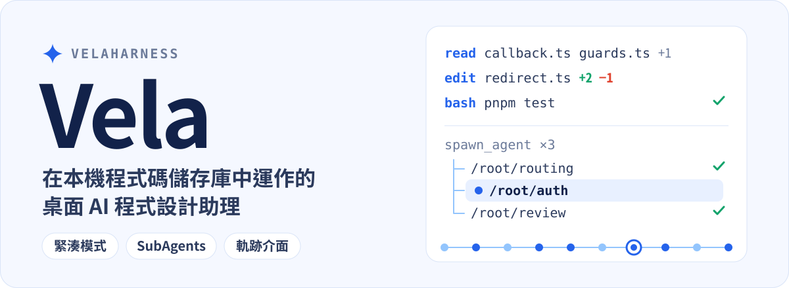

<p align="center">
  
</p>

<p align="center">
  <a href="./README.md">English</a> · <a href="./README.zh-CN.md">简体中文</a> · <b>繁體中文</b> · <a href="./README.ja.md">日本語</a> · <a href="./README.ko.md">한국어</a>
</p>

<p align="center">
  <a href="#緊湊模式">緊湊模式</a> · <a href="#subagents">SubAgents</a> · <a href="#軌跡介面">軌跡介面</a> · <a href="#快速開始">快速開始</a> · <a href="#開發指南">開發指南</a>
</p>

Vela 是一款桌面應用程式，讓 AI Agent 在你電腦上的程式碼儲存庫裡工作：理解專案、拆分任務、修改並執行程式碼。用緊湊對話查看進度，用獨立面板追蹤子代理，用執行軌跡檢查每一個步驟。

## 緊湊模式

**把工具呼叫收成流程列，讓任務內容佔據主要視野。** 緊湊模式預設開啟：讀取檔案、修改程式碼和執行指令各佔一行，連續呼叫會自動合併成可展開的摘要。點擊檔名即可在右側預覽，展開修改內容查看 diff，展開指令查看輸出；完成後還能收合整輪流程，只保留結果。

以下範例展開了檔案查閱與修改摘要，呈現「定位問題 → 實施修復 → 針對性驗證」的完整過程。

<p align="center">
  <a href="./assets/readme/vela-compact.png"></a>
</p>

在「設定 → 對話顯示 → 工具呼叫顯示」中，可切換緊湊與卡片兩種顯示方式。

## SubAgents

**主代理統籌，子代理平行查閱、實作與審閱**，互動風格與 Codex 同款。用 `spawn_agent` 拆分任務，用 `send_message` 交換發現，用 `followup_task` 繼續分派工作；子代理也能建立自己的子任務，形成依路徑組織的代理樹。

主對話保留任務概況與結論，點擊 `/root/auth` 這類代理路徑，就能在右側獨立查看它的訊息、思考、工具呼叫與最終結果。分頁與代理清單可切換子任務，主對話與子代理面板各自捲動。

範例把登入問題拆成 `routing` 查閱、`auth` 修復與 `review` 邊界審閱，右側開啟 `auth` 的執行流程。

<p align="center">
  <a href="./assets/readme/vela-subagents.png"></a>
</p>

`explore` 子代理僅能唯讀查閱；`general` 子代理使用目前會話的執行權限。新建立的子代理會話會被保存，重新開啟對話後可還原執行紀錄。

## 軌跡介面

**從對話切換到軌跡，逐節點檢查 Agent 如何得出結果**，介面編排與 DeepSeek Harness 同款。時間軸與事件清單連動，呈現思考、工具呼叫、回傳結果與助理輸出；可依時長、輪次或模型呼叫檢視時間軸，選取節點即可檢查參數、結果、Schema 與計時。

請求指標包含首 Token 延遲、生成耗時、Token 用量與快取命中率；初始系統提示詞與工具定義也能查看。舊會話缺少的指標會標示為未記錄。

範例選取了登入測試的 `bash` 呼叫，在右側查看完整回傳，並在底部查看本輪統計。

<p align="center">
  <a href="./assets/readme/vela-trace.png"></a>
</p>

> 三張截圖皆由 Vela 的真實介面元件搭配產生的範例資料算繪而成。`atlas-web` 專案、對話、測試結果、耗時與 Token 指標僅供展示，並非真實任務紀錄或效能基準。「同款」描述的是互動體驗與介面編排方式，並不代表任何隸屬關係。截圖為簡體中文介面；Vela 另提供英文、繁體中文、日文與韓文介面（「設定 → 介面 → 語言」）。

## 更多工作能力

- **Agent / Plan / Goal：** 日常讀寫執行、先擬定方案再實作，或圍繞多步驟目標持續推進。
- **本機工作區與 Git worktree：** 開啟電腦上的專案，在原工作區或獨立 worktree 中處理任務。
- **審閱與工作面板：** 查看 Git 差異與暫存狀態；右側分頁承載檔案預覽、變更與整合終端機，`⌘T` 開啟新分頁。
- **模型與帳號：** 管理模型提供者，登入帳號、填入 API 金鑰或新增自訂模型介面。
- **MCP 伺服器：** 連接本機或遠端 MCP 工具，支援全域與專案設定、依需探索、專案信任與唯讀授權。詳見 [docs/mcp.md](./docs/mcp.md)。
- **專案記憶與全域記憶：** 用兩個 Markdown 檔保存跨專案的個人偏好，以及目前專案的慣例與決策；每次執行前自動載入，可在設定中查看、編輯、清空或刪除。詳見 [docs/memory.md](./docs/memory.md)。
- **定時任務：** 依單次、每日、每週或 Cron 時間排程，每次執行都在綁定工作區的新對話中進行，可選擇執行權限、模型與推理強度。詳見 [docs/scheduled-tasks.md](./docs/scheduled-tasks.md)。
- **任務配方：** 保存參數化的任務範本，填入參數並預覽後，在新對話中啟動；支援結構化階段、審批、團隊共享與版本效果比較。詳見 [docs/task-recipes.md](./docs/task-recipes.md)。
- **整合：** 在設定中一鍵連接 Notion 等內建應用程式，不必填寫 URL 或 Token；OAuth 在系統瀏覽器中完成，憑證由系統安全儲存空間加密。詳見 [docs/built-in-mcp-plugins.md](./docs/built-in-mcp-plugins.md)。
- **外觀與上下文：** 淺色／深色主題與五種介面語言，查看上下文用量、思考強度與 Skill 活動；重新啟動後可還原。
- **圖片檢視：** 點擊訊息縮圖，即可全螢幕縮放、拖曳並切換多張圖片。

<details>
<summary>查看模型與帳號、外觀設定截圖</summary>

<p align="center">
  <a href="./assets/readme/vela-model-providers.png"></a>
</p>

<p align="center">
  <a href="./assets/readme/vela-themes.png"></a>
</p>

</details>

## 快速開始

**下載安裝。** 到 [Releases 頁面](https://github.com/KryptonGao/VelaHarness/releases/latest)取得最新的 macOS（Apple Silicon）版本：`.dmg` 為安裝檔，`.zip` 為應用程式封裝，校驗值見 `SHA256SUMS.txt`。安裝檔尚未經過公證；若 macOS 阻擋首次開啟，請到「系統設定 → 隱私權與安全性」選擇「仍要打開」。

**或從原始碼啟動。** 需要 **Node.js 22.19 或更新版本**與 **pnpm 11.24.0**（版本由 `packageManager` 欄位固定）。在儲存庫根目錄執行：

```sh
pnpm install
pnpm dev
```

開發版使用獨立的 `~/.vela-dev` 資料夾，可與使用 `~/.vela` 的已安裝 `Vela.app` 同時執行；帳號、會話與設定各自保存。從正式版同步資料與開發工具的說明，請見 [docs/development.md](./docs/development.md)（目前為簡體中文）。

首次啟動後：

1. 在「模型與帳號」設定中登入一個模型提供者，或新增自訂模型介面。
2. 選擇電腦上的專案資料夾或 Git worktree。
3. 選擇 `Agent`、`Plan` 或 `Goal` 模式，描述要完成的任務。

## 權限與本機資料

- **執行權限分三檔。**「每次詢問」會在執行終端機指令前請求批准，寫入所選工作區以外的位置時也會請求批准；「幫我批准」由目前對話選用的模型判斷風險，只有風險操作或判斷失敗時才請求批准；「完全訪問」會略過這些逐項確認。這裡的權限設定是互動式審批策略，並非作業系統層級的沙箱。
- **僅支援本機執行。** 目前在本機工作區或 Git worktree 中運行；遠端與隔離沙箱執行環境尚未實作。
- **資料保存位置。** 對話、模型帳號、工作區紀錄、執行權限與執行軌跡保存在 `~/.vela`（軌跡寫入 `~/.vela/traces`），開發版使用 `~/.vela-dev`。MCP 設定與憑證、定時任務與任務配方也保存在這裡；Electron 快取仍放在系統的應用程式支援資料夾。

<details>
<summary>修改訊息與工作區回退的範圍</summary>

使用者訊息氣泡下方提供傳送時間、複製與修改。修改後點「重新傳送」，會在同一個聊天中撤回該輪及之後的對話、計畫與代理紀錄，並從持久化檢查點還原工作區檔案；傳送前已有的未提交變更會保留。檢查點從此版本起開始記錄，舊訊息沒有檢查點時會提示無法回退；檔案之後有手動修改，或其他聊天同時在執行時，會阻止回退。回退範圍不包含 Git 索引／提交、被忽略的相依套件與建置資料夾、工作區以外的檔案，以及外部服務操作。

</details>

**Skills。** 使用者 Skill 放在 `~/.vela/skills`。目前工作區的 `.pi/skills`、`.agents/skills` 與 `~/.agents/skills` 也會載入；同名時以專案中的 Skill 優先。每個 Skill 是一個資料夾，內含具備 `name` 與 `description` 的 `SKILL.md`：

```markdown
---
name: pdf-tools
description: 從 PDF 擷取文字與表格。在閱讀、轉換或檢查 PDF 時使用。
---

# PDF tools

先閱讀本資料夾裡的說明，再處理檔案。
```

新對話預設只列出已載入 Skill 的名稱、描述與檔案路徑，需要時才讀取全文。輸入 `/skill:名稱` 即可直接展開 Skill；設定中的 Agent 頁面會列出目前已載入的 Skill，可逐一停用，也可刪除 `~/.vela/skills` 裡的 Skill（停用紀錄在 `~/.vela/skill-preferences.json`，不影響其他資料夾裡的檔案）。

## 開發指南

```sh
pnpm dev         # 啟動 Electron 開發環境
pnpm build       # 編譯桌面端程式碼
pnpm typecheck   # 檢查 TypeScript 型別
pnpm test        # 型別檢查 + 全部單元測試（與 PR 上的 CI 一致）
pnpm test:ui     # 真實 Electron 算繪層 UI 檢查
pnpm test:smoke  # 建置後執行 Electron 冒煙測試（CI 上每晚與打 tag 時執行）
pnpm test:center # 測試中心：統一執行 Node 單元測試與瀏覽器 UI 檢查（本機網頁看板）
```

主打功能截圖的範例資料、預覽網址與重拍步驟請見[截圖說明](./assets/readme/README.md)（目前為簡體中文）；預覽頁面重用實際介面元件，不會呼叫模型。頭圖由 [`assets/readme/source/build-hero.py`](./assets/readme/source/build-hero.py) 產生。

| 快速鍵 | 操作 |
| --- | --- |
| `⌘B` / `Ctrl+B` | 收合或展開左側欄 |
| `⌘J` / `Ctrl+J` | 收合或展開右側欄 |
| `⌘,` / `Ctrl+,` | 開啟或關閉設定 |
| `⌘N` / `Ctrl+N` | 新增會話 |
| `⌘T` / `Ctrl+T` | 在右側工作面板開啟新分頁 |
| `Enter` | 傳送訊息 |
| `Shift+Enter` | 輸入換行 |

### 專案結構

- `apps/desktop`：Electron 主程序、preload 與 React 介面。
- `packages/agent`：Pi 會話執行階段、模型目錄、互動模式與上下文統計。
- `packages/workspace`：工作區、worktree、Git、Pull Request 與權限審批。
- `packages/shared`：主程序與介面共用的型別與 IPC 定義。
- `packages/tools`：Agent 內建工具目錄。
- `docs/`：Plan 模式、MCP、記憶、定時任務、任務配方等專題文件（目前為簡體中文），入口見 [docs/README.md](./docs/README.md)。

## 技術細節

Vela 以 [Pi Agent](https://github.com/earendil-works/pi) 為基礎，透過 TypeScript SDK 將 Agent 執行階段嵌入桌面應用程式。Pi 提供模型介面、會話與工具執行階段；Vela 在其上實作桌面介面、任務模式、權限審批與 Git 工作區整合。

- **技術堆疊：** Electron 44、electron-vite、React 19 與 TypeScript；以 pnpm workspace 管理桌面應用程式與共用套件。Pi 精確鎖定為 `1.0.0`（`@earendil-works/pi-coding-agent`、`pi-agent-core`、`pi-ai`）；Vela 在主程序呼叫 `createAgentSession()`，不是透過啟動 Pi 命令列程式來執行 Agent。詳見 [Pi 1.0 遷移紀錄](./docs/pi-1.0-migration.md)。
- **會話與模型：** 每個對話使用獨立的 Pi `AgentSession`，訊息保存在 `~/.vela/sessions`，對話索引在 `~/.vela/conversations.json`。提供者與模型透過 Pi 的 `ModelRuntime` 載入，使用 Vela 自己的 `~/.vela` 設定，不會讀取本機的 Pi 設定。
- **工具、模式與權限：** 基礎工具為 Pi 的 `read`、`bash`、`edit` 與 `write`，Vela 包裝了 `bash`、`edit`、`write` 以接入審批。`Plan` 模式透過 ToolPolicy 禁止編輯與寫入，只放行唯讀指令，並以 `<proposed_plan>` 輸出完整方案，批准後可在目前或全新的上下文中執行；`Goal` 模式透過 `update_goal` 記錄進度。詳見 [docs/plan-mode.md](./docs/plan-mode.md) 與 [docs/plan-mode-architecture.md](./docs/plan-mode-architecture.md)。
- **MCP：** 工具預設透過 `tool_search` 依需探索，也可設為直接提供或隱藏；專案設定需要確認信任。Plan 與 `explore` 只提供已確認為唯讀的工具。
- **工作區與程序：** Git worktree 由本機 Git 指令建立，放在 `~/.vela/worktrees` 下，使用獨立的 `vela/wt-*` 分支。Pull Request 資訊透過已安裝並登入的 GitHub CLI（`gh`）讀取。Agent、檔案系統與 Git 操作由 Electron 主程序處理，renderer 透過 preload 的 IPC 呼叫；視窗啟用 `contextIsolation`，並關閉 `nodeIntegration`。

## 授權條款

[Apache-2.0](./LICENSE)
