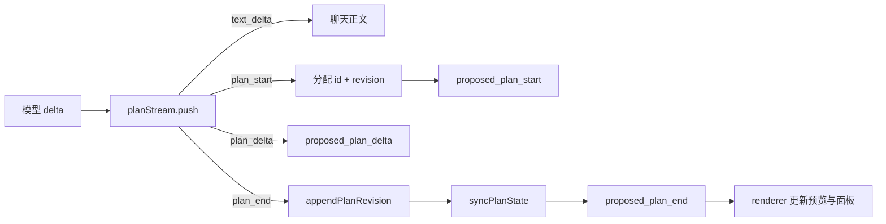

# Plan 模式实现架构

本文说明 Plan 模式在 Vela 里的实现：数据模型、流式解析、运行时编排、持久化与迁移、界面状态和测试。产品行为见 [plan-mode.md](./plan-mode.md)。

## 模块与职责

| 模块 | 职责 |
| --- | --- |
| `packages/shared/src/index.ts` | Plan / ExecutionPlan 类型、`SessionSnapshot` 投影、流事件与 IPC 契约、`VelaApi` 签名 |
| `packages/agent/src/plan.ts` | 全部纯逻辑：`<proposed_plan>` 解析、revision 管理、执行清单校验、执行输入、旧数据迁移 |
| `packages/agent/src/plan-command.ts` | `isPlanSafeCommand`：Plan 模式的只读 Shell 白名单 |
| `packages/agent/src/interaction.ts` | 模式系统提示词、工具清单、`DefaultToolPolicy`、`update_plan` 自定义工具 |
| `packages/agent/src/runtime.ts` | 会话编排：流事件、revision 落盘、`executePlan`、执行清单更新、状态同步、分支复制 |
| `packages/agent/src/conversation-store.ts` | 会话元数据（含 revision 与执行清单）的 JSON 持久化与清洗迁移 |
| `packages/agent/src/transcript.ts` | 从 Pi 会话投影重建界面消息，并把方案正文对应回 revision id |
| `apps/desktop/src/main/session-host.ts` | IPC handler：`session:set-mode`、`session:execute-plan` 等 |
| `apps/desktop/src/preload/index.ts` | 向 renderer 暴露 `setInteractionMode`、`executePlan` 等方法 |
| `apps/desktop/src/renderer/plan-draft.ts` | 渲染层纯逻辑：草稿、进度、文档状态、revision 解析、预览抽取 |
| `apps/desktop/src/renderer/components/PlanPanel.tsx` | Plan Preview、ContextPanel 引用卡、Plan Document 面板 |
| `apps/desktop/src/renderer/hooks/useSession.ts` | 订阅流事件、维护草稿与 `planFocus`、发起执行 |
| `apps/desktop/src/renderer/App.tsx` | 装配 Provider、Plan Document 打开状态、面板互斥与自动打开 |

## 数据模型

### 方案与执行清单（`packages/shared/src/index.ts`）

`ProposedPlanItem` 是一份稳定的设计规格，不承担执行进度：

| 字段 | 类型 | 说明 |
| --- | --- | --- |
| `id` | `string` | `runtime` 在 `plan_start` 时用 `randomUUID()` 分配 |
| `markdown` | `string` | 完整方案正文，经 `normalizePlanMarkdown` 处理，最长 200,000 字符 |
| `revision` | `number` | 从 1 开始，同一对话内单调递增 |
| `supersedes` | `string \| null` | 上一版 revision 的 id；首版为 `null` |
| `status` | `ProposedPlanStatus` | `draft` / `approved` / `superseded` |
| `objective` | `string \| null` | 规划开始时用户提出的原始目标，供 fresh 执行使用 |
| `createdAt` / `approvedAt` | `number` / `number \| null` | 创建时间；批准时写入，未批准为 `null` |

`ExecutionPlan` 绑定它依据的 revision，并在执行中动态调整：

| 类型 | 字段 |
| --- | --- |
| `ExecutionPlanItem` | `id`、`text`（单行，最多 200 字符）、`status`（`pending` / `in_progress` / `completed`） |
| `ExecutionPlan` | `id`、`sourcePlanId`（指向 `ProposedPlanItem.id`）、`items`、`updatedAt` |
| `PlanExecutionContextStrategy` | `"continue"` 或 `"fresh"` |

`SessionSnapshot` 向界面投影三个只读字段：`proposedPlan`（最新 revision 的克隆）、`planRevisions`（全部 revision，按 revision 升序）、`executionPlan`（当前激活的执行清单克隆）。

### 运行时内部状态（`packages/agent/src/runtime.ts`）

`Conversation` 在快照之外维护：`plans`、`latestProposedPlanId`、`executionPlans`、`activeExecutionPlanId`，以及两个流式解析字段：

- `planStream`：当前 assistant 消息的 `PlanStreamParser`，消息开始时创建，结束时清空。
- `planStreamPlan`：当前已开始但未结束的 plan 块分配到的 `{ id, revision }`。

`applyActiveTools` 根据 `mode` 和 `executionPlan !== null` 调用 `setActiveToolsByName`，并把结果写回快照的 `tools` 字段。

### 流事件（`AgentStreamEvent`）

| 事件 | 负载 |
| --- | --- |
| `proposed_plan_start` | `conversationId`、`planId`、`revision` |
| `proposed_plan_delta` | `conversationId`、`planId`、`delta` |
| `proposed_plan_end` | `conversationId`、持久化后的 `ProposedPlanItem` |

## 流式解析与事件

解析逻辑集中在 `packages/agent/src/plan.ts`：

- `proposedPlanOpenTag` / `proposedPlanCloseTag` 是 `<proposed_plan>` / `</proposed_plan>`；`proposedPlanMaxMarkdown` 为 200,000；`executionPlanItemMax` 为 50。
- `createPlanStreamParser` 是跨 delta 的状态机，有 `text` 和 `plan` 两种模式，`pending` 保存尚未消费的文本，`markdown` 累加方案正文：
  - 文本模式查找开标签；找不到时用 `longestTagPrefixSuffix` 扣住结尾可能是标签前缀的部分，等下一个 delta 再判断。找到后发出 `plan_start`，进入方案模式。
  - 方案模式查找闭标签。找到时发出 `plan_delta` 和 `plan_end`（`normalizePlanMarkdown` 非空时），回到文本模式。
  - `push` 用循环处理单个 delta 里同时出现开标签、正文、闭标签和后续普通文本的情况。
  - `flush()` 在消息结束时收尾：未闭合的方案按已结束处理；悬挂的标签前缀按普通文本放行。
- `normalizePlanMarkdown` 统一换行、去掉首尾空白，并在超长时截断并以省略号结尾。
- `extractProposedPlans` 用于历史重建：从完整文本里摘出全部方案块，返回剥离后的可见正文。

运行时接线（`runtime.ts`）：

1. 每条 assistant 消息在开始时新建 parser（方案不跨消息解析），结束时 `flush` 并清空；用户主动停止时直接丢弃，不生成半截 revision。
2. `emitPlanStream` 把解析事件翻译成流事件：普通文本走 `text_delta`；`plan_start` 分配 `randomUUID()` 和 `latestPlan(entry.plans)?.revision + 1`，写入 `planStreamPlan` 后发出 `proposed_plan_start`；`plan_delta` 带分配的 id 发出；`plan_end` 调用 `appendPlanRevision`，传入 `planObjective(entry)`，更新 `entry.plans` / `latestProposedPlanId`，调用 `syncPlanState`，再发出 `proposed_plan_end`。
3. `abort` 会把 `planStream` 和 `planStreamPlan` 置空，未写完的草稿不会成为 revision。



## 提示词与工具策略

### 模式提示词（`packages/agent/src/interaction.ts`）

`planPrompt` 要求模型：只读探索并把仓库里能查到的事实查清；只有产品偏好、无法推断的行为选择、tradeoff、缺失需求和兼容策略才用 `ask_user_question`；方案必须 decision-complete，并在回复最后输出 `<proposed_plan>` 块；修改已有方案时重新输出完整方案作为新 revision；输出后不得用 `ask_user_question` 请求确认执行。

`createModeExtension` 在 `before_agent_start` 时把 `modeSystemPrompt(mode, hasExecutionPlan)` 追加到系统提示词，并在 `tool_call` 时调用 `DefaultToolPolicy.authorizeCall`，拒绝时通过 `{ block: true, reason }` 拦截。

### 工具清单与执行前检查

`toolNamesFor` 决定激活哪些工具：

- `plan` → `read`、`bash`、`ask_user_question`。
- `goal` → 基础工作工具 + agent 树工具 + `record_goal_validation`、`update_goal`。
- `agent` → 基础工作工具 + agent 树工具 + `ask_user_question`；`hasExecutionPlan` 时再加 `update_plan`。

`DefaultToolPolicy.availableTools` 返回上面的清单；`authorizeCall` 是执行前的最后一道闸，Plan 模式下：

- `planAllowedTools` 只含 `read`、`bash`、`ask_user_question`。
- `edit`、`write`、`apply_patch` 命中 `planDeniedTools`，返回「Plan 模式不能修改文件」；其他工具返回「Plan 模式不允许调用」。
- `bash` 从 `input.command` 取命令，空命令直接拒绝，否则交给 `isPlanSafeCommand`（`plan-command.ts`）判断。

`isPlanSafeCommand` 的规则：先按 `&&`、`||`、`;`、换行和 `|` 拆段；任何一段命中 `destructivePatterns`（文件改动、重定向、依赖安装、会改动仓库的 Git 命令、提权与进程管理、交互式编辑器等）即整体拒绝；其余每一段都必须命中 `safePatterns`（只读文件与文本工具、只读 Git 子命令、版本查询、`curl`、`jq`、`awk`、`sed -n` 等）。这是执行前的字符串策略，不是操作系统级沙箱。

### `update_plan` 工具

`createModeTools` 里的 `update_plan` 接收 `{ plan: { step, status }[] }`，schema 限制最少 1 项、最多 `executionPlanItemMax`（50）项。工具直接调用 `ModeToolHost.updateExecutionPlan`，由 `runtime.updateExecutionPlan` 完成校验和落盘。

Pi 的 `createAgentSession` 把 `tools` 参数当作注册表白名单（内置与自定义都会被过滤），因此 runtime 传入的是 `[...defaultToolNames, ...modeToolNames, ...agentToolNames]`，随后再用 `setActiveToolsByName` 激活当前模式需要的子集；`modeToolNames` 必须始终并入，否则自定义工具进不了注册表。

## 运行时编排

### 批准与执行：`executePlan`

`runtime.executePlan(conversationId, strategy)`：

1. `requireIdle` 确认对话存在、没有正在生成的回复、模型可用。
2. 取 `latestPlan(entry.plans)`；没有方案时抛错「还没有可以执行的计划」。
3. `approvePlanRevision` 把目标 revision 标记为 `approved` 并写入 `approvedAt`。
4. 如果当前是 `goal` 模式，先 `pauseGoal`。
5. `continue` 分支：`bindExecution` 绑定执行清单，模式不是 `agent` 时改回 `agent`，`applyActiveTools` 激活 `update_plan`，然后 `drive` 系统提示词 `planContinuePrompt`，选项为 `hidden: true`（不在消息列表展示）、`announce: true`、`autonomous: false`、`rename: false`。
6. `fresh` 分支：先在规划对话里记录批准结果并 `syncPlanState`，再 `startFreshExecution` 新建执行对话，对其 `drive` 系统提示词 `planFreshPrompt`，其余选项相同。

`bindExecution` 通过 `bindExecutionPlan(entry.executionPlans, plan, now)` 按 `sourcePlanId` 查找已有执行清单：找到就复用（`appended: false`），否则新建。随后更新 `entry.plans`、`latestProposedPlanId`、`executionPlans`、`activeExecutionPlanId` 并 `syncPlanState`。

`startFreshExecution` 用 `addEntry(cwd, { title: freshExecutionTitle(原标题), mode: "agent", instructions })` 新建对话（`addEntry` 会把它设为激活对话），写入 `plans = [已批准方案]`、新的 `ExecutionPlan`，再 `startInternal` 启动会话。标题后缀固定为「· 执行」。

### 执行输入

`plan.ts` 里两份 prompt：

- `planContinuePrompt`：`Implement the approved plan.` + 已批准 revision 编号与 id + `update_plan` 使用说明。
- `planFreshPrompt`：`Implement this plan.` + `# Objective`（`objective`，缺失时写 `(not recorded)`）+ `# Approved Plan (revision N)` + 完整 Markdown + 同样的使用说明。

`isPlanExecutionPrompt` 按两个开头识别系统代发的执行输入，用于：历史重建时过滤隐藏消息（`transcript.ts`）、对话活动计数（`runtime.ts` 的 `countConversationActivity`）、`planObjective` 跳过这些消息。

`planObjective` 取会话里最近一条非系统代发的用户消息文本并截断，作为 revision 的 `objective`。

## 执行清单校验

`applyExecutionPlanUpdate(execution, update, now)` 的规则：

- `update` 必须是数组且非空，否则报错「执行清单至少需要一项。」；超过 50 项报错。
- 每项 `status` 必须在 `pending` / `in_progress` / `completed` 中，否则报错。
- `step` 经 `singleLine` 压成单行并截到 200 字符；空文本或重复文本会被跳过。
- 文本与已有条目完全一致时复用原条目 `id`，其余生成新 `randomUUID()`，因此允许新增、调整和合并条目。
- 清理后仍为空报错；`in_progress` 超过一项报错「最多只能有一项处于进行中。」。
- 成功时返回替换后的 `ExecutionPlan`，只更新 `items` 和 `updatedAt`，不触碰 `ProposedPlanItem`。

`runtime.updateExecutionPlan` 把结果写回 `entry.executionPlans` 中 id 匹配的那一份，再 `syncPlanState`。渲染层用 `planProgress`（`plan-draft.ts`）计算 `completed` / `total` / `percent` / `active`，只读取 `ExecutionPlan`，与方案正文无关。

## 界面结构与状态

### 文档状态与草稿

`plan-draft.ts` 提供渲染层纯函数：

- `PlanDocumentState` + `planDocumentReducer`：`open` 同时设置 `activePlanId` 和 `selectedRevisionId`；`select` 只改选中版本；`close` 回到 `emptyPlanDocumentState`。它是纯 UI 状态，不影响会话数据，由 `App.tsx` 用 `useReducer` 持有。
- `applyPlanDraft`：`proposed_plan_start` 建立 `{ id, revision, markdown: "", streaming: true }`；`delta` 只累加匹配 id 的草稿；`end` 返回 `null`，之后正文由持久化的 `ProposedPlanItem` 接管。
- `resolvePlanRevision`：显式选中的版本优先，否则取最新（流式草稿优先）；非最新版本 `readOnly: true`，草稿 `streaming: true`。
- `planRevisionEntries`：修订菜单数据，最新在前；生成中的草稿插到最前。
- `planActionState`：`canExecute` / `canRevise` 要求存在方案、没有草稿且对话空闲。
- `planExecutionChoices`：`continue` 与 `fresh` 两条固定路径及中英文文案。
- `planPreviewInfo`：从 Markdown 抽 H1 标题（通用标题如 `Plan` / `计划` / `实施方案` 会被替换）、H2 章节和概述段落，用于预览卡与引用卡。
- `planReferenceModel`：ContextPanel 引用卡的轻量模型，只含标题、版本、状态和进度，不含正文。
- `collectPlanIds`：按出现顺序去重收集一轮里所有 assistant 消息的 `planIds`。

### 事件到界面（`useSession.ts`）

- `planDrafts` 按 conversationId 保存草稿；`planFocus` 保存 `{ planId, nonce }`。
- 收到 plan 事件时：更新草稿、用 `attachPlanToLastAssistant` 把 revision 挂到当前对话最后一条 assistant 消息；收到 `proposed_plan_start` 且事件属于当前激活对话时，更新 `planFocus` 触发自动打开。
- `executePlan` 调用 `api.executePlan(id, strategy)` 并用返回的 `AppState` 更新状态；失败写入对话级错误。
- `attachPlanToLastAssistant` 只在末尾 assistant 消息上追加、去重。历史恢复时由 `transcript.ts` 重建同样的关联。
- `App.tsx` 的 effect 监听 `session.planFocus` 并调用 `openPlan`；`openPlan` 会先关闭子代理面板，`openAgentPane` 会先关闭 Plan Document，右侧同时只保留一个聚焦视图。

### 面板与渲染

- `PlanDocumentProvider` 由 `App.tsx` 包裹 `ChatView`、`AgentPane`、`PlanDocumentPane` 和 `ContextPanel`，向下提供 `plans`（来自 `session.state.session.planRevisions`）、`draft`、`activePlanId`、`selectedRevisionId` 和三个动作。
- `PlanDocumentPane` 渲染在 `ChatView` 之后、`ContextPanel` 之前，内缘是 `SidebarResizeHandle target="plan"`，宽度由窗口级 `useSidebarResize` 管理。头部有复制 Markdown、修订菜单、关闭；正文是 `Markdown`；底部按 `resolved.readOnly` 显示只读提示，或显示「继续修改」/「执行计划」操作栏。执行进度在 `execution && progress.total > 0` 时显示。
- `planScrollPositions` 是模块级 `Map<revisionId, scrollTop>`：切换 revision 时恢复对应版本的位置，滚动时记录；只在本次运行内有效。
- `PlanPreviewList` 渲染在聊天里：`ChatView` 对每个 turn 用 `collectPlanIds(turn.assistants)`，历史回退路径对所有消息调用同样的收集函数。
- `ContextPanel` 在 `session.proposedPlan || planDraft` 存在时渲染 `PlanReferenceCard`，点击打开对应 revision。

## 持久化与迁移

`packages/agent/src/conversation-store.ts` 负责 `~/.vela/conversations.json`：

- `StorePayload.version` 为 `2`；`StoredConversation` 新增 `plans`、`latestProposedPlanId`、`executionPlans`、`activeExecutionPlanId` 四个字段。
- 写入按 `persistDelayMs`（400ms）防抖合并，先写 `.tmp` 再 `rename`；退出前 `flushSync` 同步落盘。
- `normalize` 在读取时清洗数据：`normalizePlans` / `normalizeProposedPlan` 丢弃没有 id、没有正文或 revision 小于 1 的条目并按 revision 排序；`normalizeExecutionPlans` / `normalizeExecutionPlan` 丢弃缺少 id 或 `sourcePlanId` 的清单，条目文本为空则跳过，非法状态回退为 `pending`；id 重复只保留第一条。
- 指针修复：`latestProposedPlanId` 指向不存在的版本时回退到最新 revision；`plans` 非空但没有指针时补上最新；`activeExecutionPlanId` 指向不存在的清单时置空。
- 迁移：当 `plans` 为空时读取旧 `record.plan`，交给 `normalizeLegacyPlan` + `migrateLegacyPlan`。旧记录要求 `title` 与 `overview` 是字符串，并至少有一个带 id 和非空文本的步骤，否则整体丢弃。迁移产出一份 revision 1 的方案：`legacyPlanMarkdown` 把 title / overview / steps 拼成 Markdown；只要任一旧步骤已勾选，或读取时对话已经是 `agent` 模式，就标记为 `approved` 并生成执行清单（`done` 的步骤转成 `completed`，其余 `pending`）；否则保持 `draft` 且不生成执行清单。
- `runtime.initialize` 只恢复 `sessionFile` 仍存在且磁盘上确有文件的对话；恢复时把 `plans`、执行清单和工具清单一起写进快照。
- 分支对话（`runtime.branchConversation`）复制 `plans` 和 `latestProposedPlanId`，让分支里的历史 Plan Preview 能对应到文档；不复制执行清单，因为分支是新的执行上下文。

历史消息重建（`transcript.ts`）会把 assistant 文本里的 `<proposed_plan>` 块剥离，然后按正文内容把块对应回 revision：优先用 `normalizePlanMarkdown` 后的精确匹配，匹配不到就按顺序取尚未认领的 revision，最终写入 `TranscriptMessage.planIds`。

## IPC 与 API

| 通道 | 方向 | 说明 |
| --- | --- | --- |
| `session:set-mode` | invoke | `setInteractionMode(mode, conversationId?)`；进入 Plan 模式或从 Plan 切回其他模式 |
| `session:execute-plan` | invoke | `executePlan(conversationId?, strategy?)`，strategy 缺省为 `continue` |
| `session:event` | push | `proposed_plan_start` / `proposed_plan_delta` / `proposed_plan_end` 等流事件 |

`session-host.ts` 的 handler 用 `parsePlanExecutionStrategy` 校验策略：空值或 `null` 回退 `continue`，只接受 `continue` / `fresh`，其余抛「不支持的计划执行方式」。运行时抛出的错误会转成 `{ type: "error", conversationId, message }` 广播给 renderer，并返回最新 `AppState`。`preload/index.ts` 对应暴露 `setInteractionMode` 与 `executePlan`，后者未传策略时补 `"continue"`。

## 边界情况

- **忙时拒绝**：`requireIdle` 在上一轮回复进行中时抛「上一个回复还在进行中」；`setMode` 在流式中抛「回复进行中，不能切换模式」。
- **没有方案**：`executePlan` 抛「还没有可以执行的计划」。
- **中止**：`abort` 清空 parser 与分配信息，未输出的方案不会保存；已经 `plan_end` 的 revision 不受影响。
- **空方案**：解析结果 `normalizePlanMarkdown` 后为空时不发 `plan_end`，不会产生空 revision。
- **超长输出**：方案正文截断到 200,000 字符；执行项最多 50 条；单条执行项文本截断到 200 字符。
- **一条消息多个方案块**：parser 在闭标签后回到文本模式，可以继续解析同一个 delta 流里的下一个块；两个 revision 都会产生，聊天卡片按顺序展示。
- **同一 revision 重复执行**：`continue` 复用已有执行清单；`fresh` 每次都新建执行对话和清单。
- **模式优先级**：批准时 `Goal` 模式会先暂停目标；`executePlan` 也会把非 Agent 模式切回 `agent`。
- **旧数据**：无法解析的旧计划字段被忽略，不会阻塞会话加载；迁移只在 `plans` 为空时执行一次，之后按新格式读写。

## 测试矩阵

| 文件 | 覆盖 |
| --- | --- |
| `packages/agent/test/plan.test.ts` | Plan 模式约束（提示词、只读工具、`update_plan` 暴露条件、旧工具协议移除）、ToolPolicy（拒绝写文件与破坏性命令、放行只读命令、不放行 agent 树工具）、`<proposed_plan>` 流式解析（跨 delta 标签、完整块、未闭合收尾、前缀不泄漏、`extractProposedPlans`）、revision（不覆盖旧版、批准只改目标版本）、ExecutionPlan（绑定与复用、最多一项进行中、按文本复用 id）、执行输入识别、旧计划迁移 |
| `packages/agent/test/plan-store.test.ts` | `ConversationStore` 的 version 1 迁移、重启后恢复 revision 与 ExecutionPlan、指针失效回退 |
| `apps/desktop/test/plan-draft.test.ts` | 草稿跨事件累加并在 `plan_end` 清空、忽略其他 revision 的 delta、执行进度只来自 ExecutionPlan |
| `apps/desktop/test/plan-document.test.ts` | Plan Preview 挂载与去重、Plan Document 打开/关闭/切换 revision、历史版本只读、流式草稿、查看动作状态、执行菜单复用策略、引用卡不带正文、预览信息抽取与回退、多个 plan 的顺序收集 |

运行命令：

```sh
pnpm --filter @vela/agent test          # 包含 plan.test.ts 与 plan-store.test.ts
pnpm --filter @vela/desktop test:plan   # 包含 plan-draft.test.ts 与 plan-document.test.ts
```

## 代码索引

| 文件 | 关键符号 |
| --- | --- |
| `packages/shared/src/index.ts` | `ProposedPlanItem`、`ProposedPlanStatus`、`ExecutionPlan`、`ExecutionPlanItem`、`ExecutionItemStatus`、`PlanExecutionContextStrategy`、`SessionSnapshot`、`AgentStreamEvent`、`VelaApi.executePlan` |
| `packages/agent/src/plan.ts` | `createPlanStreamParser`、`extractProposedPlans`、`normalizePlanMarkdown`、`appendPlanRevision`、`approvePlanRevision`、`latestPlan`、`bindExecutionPlan`、`applyExecutionPlanUpdate`、`planContinuePrompt`、`planFreshPrompt`、`isPlanExecutionPrompt`、`migrateLegacyPlan` |
| `packages/agent/src/plan-command.ts` | `isPlanSafeCommand` |
| `packages/agent/src/interaction.ts` | `planPrompt`、`toolNamesFor`、`modeSystemPrompt`、`DefaultToolPolicy`、`createModeExtension`、`createModeTools`、`modeToolNames` |
| `packages/agent/src/runtime.ts` | `executePlan`、`emitPlanStream`、`planObjective`、`bindExecution`、`startFreshExecution`、`updateExecutionPlan`、`syncPlanState`、`applyActiveTools`、`freshExecutionTitle` |
| `packages/agent/src/conversation-store.ts` | `StoredConversation`、`StorePayload`、`normalize`、`normalizeProposedPlan`、`normalizeExecutionPlan`、`persistDelayMs`、`flushSync` |
| `packages/agent/src/transcript.ts` | `transcriptFromProjection`、`transcriptFromSources` |
| `apps/desktop/src/renderer/plan-draft.ts` | `applyPlanDraft`、`planDocumentReducer`、`resolvePlanRevision`、`planRevisionEntries`、`planActionState`、`planExecutionChoices`、`planPreviewInfo`、`planReferenceModel`、`collectPlanIds`、`planProgress` |
| `apps/desktop/src/renderer/components/PlanPanel.tsx` | `PlanDocumentProvider`、`usePlanDocument`、`PlanPreviewList`、`PlanReferenceCard`、`PlanDocumentPane` |
| `apps/desktop/src/renderer/hooks/useSession.ts` | `planDrafts`、`planFocus`、`executePlan`、`attachPlanToLastAssistant` |
| `apps/desktop/src/main/session-host.ts` | `sessionSetMode` / `sessionExecutePlan` handler、`parsePlanExecutionStrategy` |
| `apps/desktop/src/preload/index.ts` | `setInteractionMode`、`executePlan` |

## 相关文档

- [Plan 模式使用说明](./plan-mode.md)
- [文档索引](./README.md)
